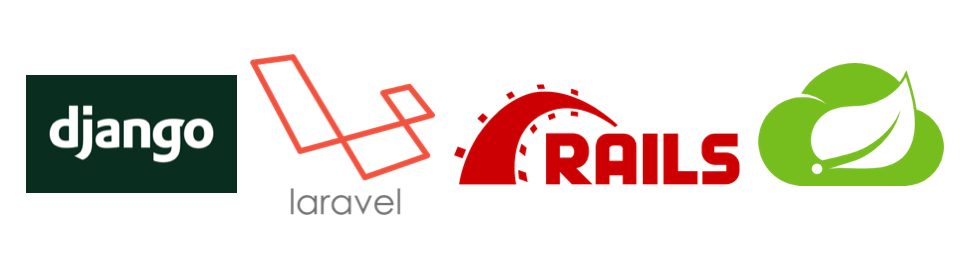
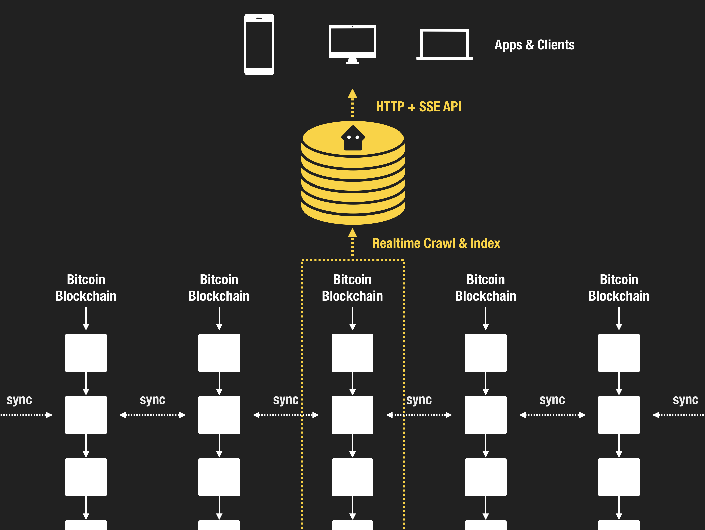

# Planaria

> Infinite Immortal API over Bitcoin

<a href='https://planaria.network' class='btn'>Planaria Network</a>
<a href='https://github.com/interplanaria' class='btn'>GitHub</a>
<a href='https://bitdb.network/atlantis' class='btn'>Slack</a>
<a href='https://twitter.com/_unwriter' class='btn'>Twitter</a>

---

## What

Are you familiar with API frameworks like [Ruby on Rails](https://en.wikipedia.org/wiki/Ruby_on_Rails), [Django](https://en.wikipedia.org/wiki/Django_(web_framework)), [Laravel](https://en.wikipedia.org/wiki/Laravel), [Spring](https://en.wikipedia.org/wiki/Spring_Framework), etc.?

**Planaria is like these frameworks, but:**

1. 100% powered by Bitcoin.
2. Containerized as an API Microservice.
3. Only requires JavaScript skills to program.

Anyone can build and publish a public Planaria node, and anyone can connect to the public Planaria nodes to build serverless apps. Check out some public Planaria nodes you can use right now:

<a href='https://planaria.network' class='btn'>Browse Planaria Network</a>

---

## How

Here's how it works:

1. **Crawl:** Planaria crawls the Bitcoin blockchain programmatically.
2. **Index:** Indexes the crawled result in a MongoDB instance.
3. **Serve:** Provides a Docker containerized HTTP[S] and SSE (Server Sent Events) Microservice API endpoint.

**Thanks to the containerized architecture, everything is portable.** No one organization can own an API endpoint. Anyone can deploy and run a public Planaria API endpoint with just a single command.

---

## Why

Why build APIs on Bitcoin?

1. **Portable & Serverless:** There is no single server that runs the API. Anyone can instantly start a Planaria node.
2. **Transparent:** Build 100% Transparent APIs. Both data and code are stored publicly on Bitcoin.
3. **Immutable:** Build APIs that cannot be altered once deployed.
4. **Immortal:** Build APIs that can outlive the host, forever. Even if one node goes away, anyone can come along and reproduce EXACTLY the same node.
5. **Monetizable:** Build APIs that can be seamlessly monetized natively with Bitcoin.

---

## Features

Planaria is an all-in-one framework for building, publishing, and running Bitcoin-powered Microservice API endpoints with:

- **Universal Query language:** A powerful [built-in declarative query language (Bitquery)](query) that is portable, programmable, and Turing complete.
- **HTTP[S]:** A Developer friendly HTTP[S] API that can be used in any environment (web, mobile, server-side, embedded, etc.), with any programming language, thanks to the JSON-based portable query language.
- **SSE (Server Sent Events):** A programmable push API which lets consumers subscribe to various Bitcoin event patterns, using the same query language.

---

## Introduction

Learn how Bitcoin + Planaria changes how applications work

<a href='/#/intro' class='btn'>Introduction</a>

---

## Planaria Computer

Planaria Computer is a command line interface application that lets you build and manage Planaria API and nodes.

<a href='/#/pc' class='btn'>Learn Planaria Computer</a>

---

## Planaria Network

Planaria Network is a registry where you can publish Planaria state machines.

There are two modes of publishing:

1. **Publish the Code:** Share the code, so other people (or yourself) can run the code.
2. **PublLet the API:** Open up your node for others to use as backend.

<a href='/#/network' class='btn'>Learn Planaria Network</a>

---
## Community & Help

Before diving in, here are some useful links that may be helpful in your journey with Planaria:

> Twitter: Follow [@_unwriter](https://twitter.com/_unwriter) on Twitter for Planaria related announcements.
>
> Github: Planaria [Github Repository](https://github.com/interplanaria). Planaria is 100% open sourced.
>
> Slack: Have questions? [Join the Atlantis Slack](https://bitdb.network/atlantis) and meet other Bitcoin developers.

---
