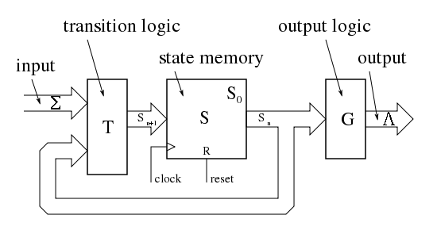
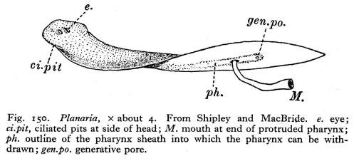
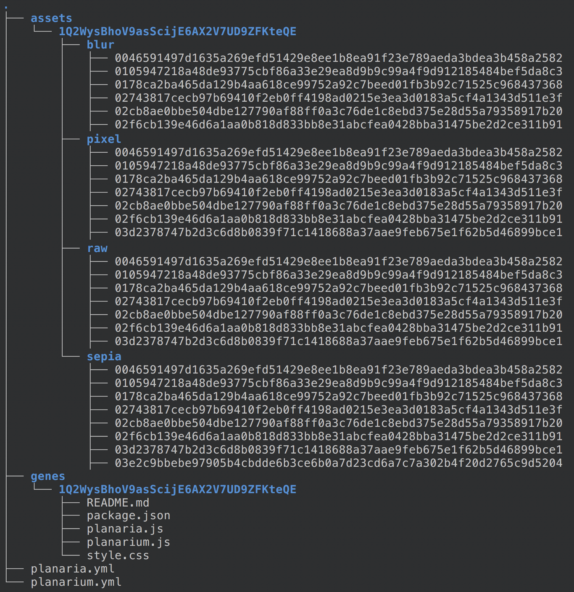
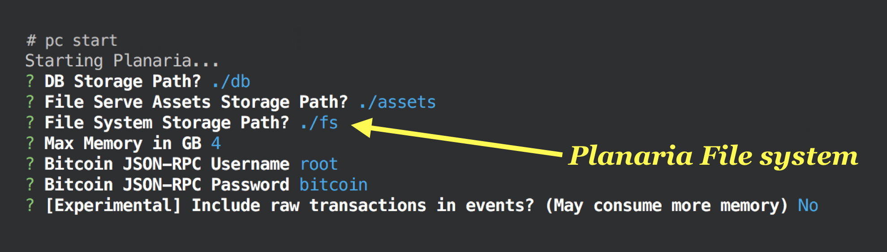
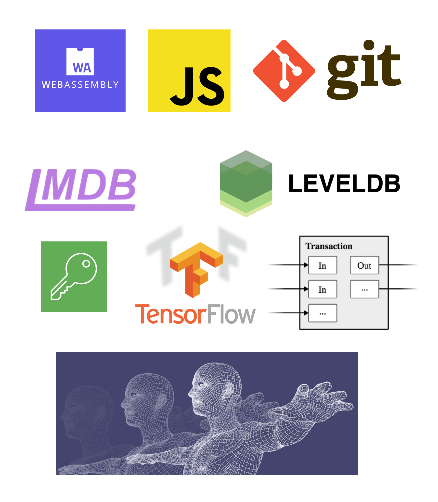
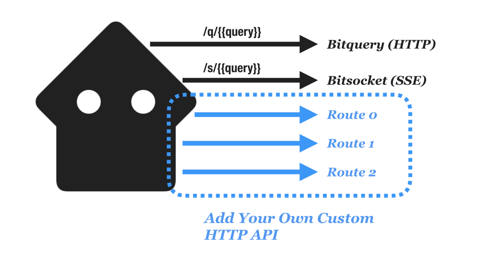
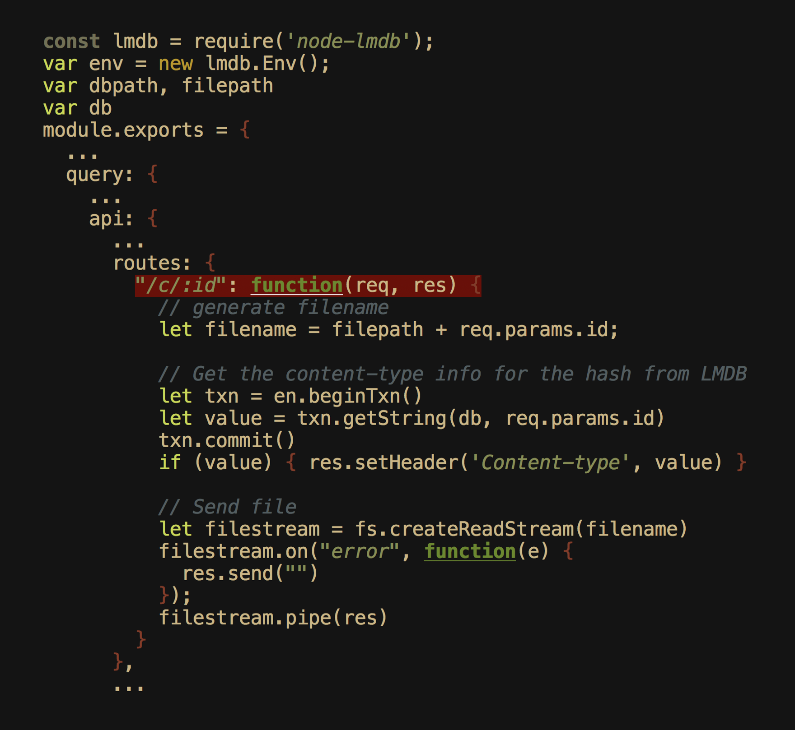

# Node API

This page explains the Planaria framework API that lets you build a Planaria node.

> If you're just trying to build a serverless frontend app USING a Planaria node, see ["Use Planaria" Guide](guide?id=a-use-a-node). This section is about building a new Planaria backend node.

There are two parts to Planaria framework:

- [Planaria](#planaria-api): **The WRITE interface**. Only Bitcoin can write to Planaria. Programming Planaria means telling Bitcoin "how" to write to the state machine.
- [Planarium](#planarium-api): **The READ interface**. This is the external-facing part. It describes how the HTTP and SSE (Server Sent Events) should process and respond to requests, including advanced features like virtual attributes.

# Planaria API

Planaria is the Bitcoin facing part of the Planaria framework.

This page will walk you through how you can write a Planaria program.

> Once you have built a Planaria, you will want to publish or run it.
>
> You can learn more about publishing, deploying, and running a Planaria program [here](/serve)


## Overview

**Every Planaria is a state machine, powered by Bitcoin.**



1. **Input:** An event listener that listens to realtime events from Bitcoin.
2. **Transition Logic:** A program that handles state transition
3. **State Memory:** A "memory" to persist and update the state
4. **Output Logic:** An event producer that publishes custom programmable events for other modules

Planaria lets you express all of the above as a single portable JavaScript object.

## Anatomy of a Planaria



Every Planaria state machine is a **SINGLE node.js module object** that follows the following convention:

```
module.exports = {
  planaria: ...,
  from: ...,
  name: ...,
  version: ...,
  description: ...,
  address: ...,
  index: { ... },
  onmempool: async function(m) { ...  },
  onblock: async function(m) { ...  },
  onrestart: async function(m) { ...  }
}
```

Here's what each attribute represents:

- `planaria`: Planaria schema version (Currently '0.0.1')
- `from`: The block height to start crawling from
- `name`: The name of state machine this state machine will be published as
- `version`: The state machine version (Your application version)
- `description`: The description of the state machine to be advertised to the Planaria Network
- `address`: Bitcoin address tied to this state machine (You can generate a unique address using the Planaria Computer)
- `index`: a declarative descrition of the database index for faster queries and retrievals
- `onmempool`: an event handler for handling realtime mempool transactions
- `onblock`: an event handler for handling new block events
- `onrestart`: an event handler for when the state machine restarts (used to do cleanup, etc. for handling unexpected crashes or restarts)


## API

There are largely four classes of APIs you need to understand:

1. **Attributes:** Define various attributes declaratively.
2. **Event Handlers:** Listen to Bitcoin events.
3. **State API:** Write to Planaria State Machine.
4. **Publish API:** Publish events.

### 1. Attributes

These are the attributes used to describe the state database. Most of these attributes are auto-generated for you as a scaffold when you run the `pc` command:

#### planaria

The schema version of Planaria engine itself. Currently `0.0.1`.

#### from

The block height to start crawling from.

#### name

The name of state machine this state machine will be published as.

#### version

The state machine version (Your application version)

#### description

The description of the state machine to be advertised to the Planaria Network

#### address

Bitcoin address tied to this state machine (You can generate a unique address using the Planaria Computer)

#### index

A declarative description of the database index for faster queries and retrievals.

The syntax:


```
{
  index: {
    <Collection Name>: {
      "keys": [<Index Key0>, <Index Key1>, <Indx Key2>, ...],
      "unique": [<Unique Index Key0>, ...],
      "fulltext": [<Fulltext Index Key0>, <Fulltext Index Key1>, ...]
    }
  }
}
```

**Example 1:**

- One collection: `block`
- Put index on keys `hash`, `confirmations`, ...
- Ensure that the key `hash` is unique

```
{
  ...
  index: {
    block: {
      keys: [ 'hash', 'confirmations', 'size', 'height', 'version', 'versionHex', 'merkleroot', 'tx', 'time', 'mediantime', 'nonce', 'bits', 'difficulty', 'chainwork', 'previousblockhash', 'coinbase' ],
      unique: ['hash'],
    },
  },
  ...
}
```

**Example 2:**

- Two collections: `c` and `u`
- Put index on `tx.h`, `blk.i`, ... 
- Ensure that `tx.h` is unique
- Create a single full text index for each collection based on keys `out.s0`, `out.s1`, ...

```
{
  ...
  index: {
    c: {
      keys: [
        'tx.h', 'blk.i', 'blk.t', 'blk.h',
        'in.e.a', 'in.e.h', 'in.e.i', 'in.i',
        'out.e.a', 'out.e.i', 'out.e.v', 'out.i',
        'in.b0', 'in.b1', 'in.b2', 'in.b3', 'in.b4', 'in.b5', 'in.b6', 'in.b7', 'in.b8', 'in.b9', 'in.b10', 'in.b11', 'in.b12', 'in.b13', 'in.b14', 'in.b15',
        'out.b0', 'out.b1', 'out.b2', 'out.b3', 'out.b4', 'out.b5', 'out.b6', 'out.b7', 'out.b8', 'out.b9', 'out.b10', 'out.b11', 'out.b12', 'out.b13', 'out.b14', 'out.b15',
        'out.s0', 'out.s1', 'out.s2', 'out.s3', 'out.s4', 'out.s5', 'out.s6', 'out.s7', 'out.s8', 'out.s9', 'out.s10', 'out.s11', 'out.s12', 'out.s13', 'out.s14', 'out.s15'
      ],
      unique: ['tx.h'],
      fulltext: ['out.s0', 'out.s1', 'out.s2', 'out.s3', 'out.s4', 'out.s5', 'out.s6', 'out.s7', 'out.s8', 'out.s9', 'out.s10', 'out.s11', 'out.s12', 'out.s13', 'out.s14', 'out.s15', 'in.e.a', 'out.e.a']
    },
    u: {
      keys: [
        'tx.h',
        'in.e.a', 'in.e.h', 'in.e.i', 'in.i',
        'out.e.a', 'out.e.i', 'out.e.v', 'out.i',
        'in.b0', 'in.b1', 'in.b2', 'in.b3', 'in.b4', 'in.b5', 'in.b6', 'in.b7', 'in.b8', 'in.b9', 'in.b10', 'in.b11', 'in.b12', 'in.b13', 'in.b14', 'in.b15',
        'out.b0', 'out.b1', 'out.b2', 'out.b3', 'out.b4', 'out.b5', 'out.b6', 'out.b7', 'out.b8', 'out.b9', 'out.b10', 'out.b11', 'out.b12', 'out.b13', 'out.b14', 'out.b15',
        'out.s0', 'out.s1', 'out.s2', 'out.s3', 'out.s4', 'out.s5', 'out.s6', 'out.s7', 'out.s8', 'out.s9', 'out.s10', 'out.s11', 'out.s12', 'out.s13', 'out.s14', 'out.s15'
      ],
      unique: ['tx.h'],
      fulltext: ['out.s0', 'out.s1', 'out.s2', 'out.s3', 'out.s4', 'out.s5', 'out.s6', 'out.s7', 'out.s8', 'out.s9', 'out.s10', 'out.s11', 'out.s12', 'out.s13', 'out.s14', 'out.s15', 'in.e.a', 'out.e.a']
    }
  },
  ...
}
```

---

### 2. Event Handlers

There are three types of events:

1. `onmempool`: new realtime mempool transaction
2. `onblock`: new block event, including all the transactions
3. `onrestart`: triggered when the node restarts. important for cleaning up before restart crawling.

#### onmempool

The `onmempool` method gets triggered whenver there's a new incoming mempool transaction.

You can implement the event handler by making use of the machine objct that gets passed into the handler as argument.

```
{
  ...
  onmempool: function(m) {
    /*****************************************
    *
    *   Do something with m, where:
    *
    *   m := {
    *     input: <Transaction in TXO Format>,
    *     state: <State API>,
    *     output: <Publish API>
    *   }
    *
    *****************************************/
  },
  ...
}
```

The `m` variable consists of two attributes:

- `input`: The incoming transaction event object
- `state`: The CRUD API object
- `output`: The publish API

You can use the `input` to derive any data, and write it the `state` object through the CRUD API.


#### onblock

```
{
  ...
  onblock: function(m) {
    /********************************************************************************************************************
    *
    *   Do something with m, where:
    *
    *   m := {
    *     input: {
    *       block: {
    *         info: {
    *           "hash": "000000000000000000410544d7cfe8f90b81daa1f02469a40be99e455c671be7",
    *           "confirmations": 151461,
    *           "size": 853803,
    *           "height": 411501,
    *           "version": 4,
    *           "versionHex": "00000004",
    *           "merkleroot": "efeb98352db1ad0ff691a8d76a552134f464648e09cc598e9b850b9aebbb8fa6",
    *           "tx": [
    *             "d14bb27028ce113f26b1ddee282479c573729b500dd3eda9249ccca360cf576e",
    *             "5432ca41143c74dc6dbb5551c817a50901fe1559b963f8a9731656f9136f52d2",
    *             "3ac66bbf21ad279223cab8b166f4c74621f98eff6ffb4cbf3fd080da88b5bb23",
    *             "3865e7facad32626dcd45584f830ce0ae439008a5271aa828158a96cd38b5de4",
    *             "8b3244fb3cd991bc216d27d11f863f44e55ae8f1f5d9655714a0b4caa408f573",
    *             "0143601e1a1621e94e0802fe44112a6a7f6ed889128dab537531158b8c27d565",
    *           ],
    *           "time": 1463095538,
    *           "mediantime": 1463093385,
    *           "nonce": 4098576299,
    *           "bits": "1805a8fa",
    *           "difficulty": 194254820283.44,
    *           "chainwork": "00000000000000000000000000000000000000000019172cdab3f28b3ad7c0ec",
    *           "previousblockhash": "00000000000000000258adbacc58c8acd91d492943ad64ab740ca5fa74b7f2a6",
    *           "nextblockhash": "000000000000000000b66d9af7a90a4335c59384f0c7cef926a63d4303a65811",
    *           "coinbase": "036d47061e4d696e656420627920416e74506f6f6c20626a3020201a535520573510efe0030000ea5c5581"
    *         },
    *         items: [
    *           <Transaction in TXO Format>,
    *           <Transaction in TXO Format>,
    *           ...
    *           <Transaction in TXO Format>
    *         ]
    *       },
    *       mempool: {
    *         info: { },
    *         items: [
    *           <Transaction in TXO Format>,
    *           <Transaction in TXO Format>,
    *           ...
    *           <Transaction in TXO Format>
    *         ]
    *       }
    *     },
    *     state: <Database API>,
    *     clock: {
    *       bitcoin: {
    *         now: <Bitcoin Height>
    *       },
    *       self: {
    *         now: <Machine Height>
    *       }
    *     }
    *   }
    *
    ********************************************************************************************************************/
  },
  ...
}
```

#### onrestart

Triggered when a node **restarts**.

Use this handler to clean up before resuming since last run. You can use the `m.state.delete` method to conditionally delete any items you want.

Useful for when a node gets shut down unexpectedly.

```
{
  ...
  onblock: function(m) {
    /*****************************************
    *
    *   Do something with m, where:
    *
    *   m := {
    *     state: <State API>,
    *     clock: {
    *       bitcoin: {
    *         now: <Bitcoin Height>
    *       },
    *       self: {
    *         now: <Machine Height>
    *       }
    *     }
    *   }
    *
    *****************************************/
  }
}
```


### 3. State API

You can access the state CRUD API through:

-  `m.state.create`
-  `m.state.read`
-  `m.state.update`
-  `m.state.delete`


#### create

Insert a new document to the database (Create)

- `name`: the collection name. You can store to as many collections as you want, and thanks to the no-schema nature of MongoDB it will just store them all.
- `data`:
  - **one item:** if it's a regular object, it will be inserted as a single document
  - **an array of items:** if it's an array, it will be bulk inserted as multiple documents

```
await m.state.create({
  name: <COLLECTION_NAME>,
  data: <ITEM|ITEMS>
}).catch(function(e) {
  if (e.code != 11000) {
    console.log("# onmempool e = ", e)
  } else {
    console.log("duplicate", m.tx)
  }
})
```

#### read

You can determine the next state transition not only based on the incoming event, but also based on the current state, simply by querying the state database with `read`.

```
await m.state.read({
  name: <COLLECTION_NAME>,
  filter: {
    find: <MONGODB_FIND_FILTER>,
    project: <MONGODB_PROJECT>,
    sort: <MONGODB_SORT>,
    limit: <MONGODB_LIMIT>,
    skip: <MONGODB_SKIP>,
  }
})
```


#### update

In order to provide a simple interface for updating, the `update` API takes the following approach:

1. Delete all items that match the `filter.find` query
2. Transform the deleted items using the `map()` function
3. Re-insert the transformed items to the collection

> This approach works for most cases because the insertion order doesn't matter for most Planaria state machines, since everything can be ordered by block time.
>
> However, if you DO want to enforce certain order, you may want to take care of this manually, programmatically.

```
await m.state.update({
  name: <COLLECTION_NAME>,
  filter: {
    find: <MONGODB_FIND_FILTER>
  },
  map: function(item) {
    /********************************************************
    * A Transformer function that takes each filtered item
    * from "filter" and transforms it to a new item
    ********************************************************/
    let new_item = DO_SOME_TRANSFORM(item)
    return new_item
  }
}).catch(function(e) {
  if (e.code != 11000) {
    console.log("# onblock error = ", e)
    process.exit()
  }
})
```

#### delete

Delete all items that match certain MongoDB filter

This is especially handy inside `onrestart`, where you can use it to clean up any dangling documents since the last shutdown. 

```
let res = await m.state.delete({
  name: <COLLECTION_NAME>,
  filter: {
    find: <MONGO_FIND_FILTER>
  }
}).catch(function(e) {
  console.log("# onblock prune error = ", e)
})
```

### 4. Publish API

Output APIs are for publishing events.

When you publish an event, you can consume it from:

1. **Planarium:** The `socket` API automatically turns the event you publish here into an SSE event.
2. **Any other modules:** Other modules can listen to the event through Zeromq.

#### publish

After taking care of all the state transition tasks, you can publish an event with zeromq by calling the `output.publish` method, which takes an object as an argument, which contains two attributes:

1. `name`: The topic name to publish to
2. `data`: The data to publish

Here's an example:

```
onblock: function(m) {
  ...
  m.output.publish({
    name: 'block',
    data: m.input.block.info
  })
}
```

### 5. File Serve API

Planaria manages its state with MongoDB. This turns the 2 dimensional blockchain into a 3 dimensional hyper-queryable state machine, which is what makes Planaria powerful.

However, sometimes you may want to let Planaria read/write static files and serve them as well. For example, you may want to **use incoming Bitcoin transactions to trigger certain logic to create/read/update/delete files**, and then serve them as API.

And **This** is File Serve API, powered by [Docker Volumes](https://docs.docker.com/storage/volumes/)

1. [Planaria](https://docs.planaria.network/#/api?id=planaria-api) and [Planarium](https://docs.planaria.network/#/api?id=planarium-api) each has a shared folder at path `public/assets/[Planaria Machine Address]` **inside each container**. This is also available outside of the container at `assets/[Planaria Machine Address]` folder. ([Learn more about how Docker volumes work](https://docs.docker.com/storage/volumes/))
2. This means, if you write to the `public/assets/[Planaria Machine Address]` path from Planaria, it will be instantly available to serve over HTTP at `/assets/[Planaraia Machine Address]/[filename]` through Planarium API endpoint.
3. Note that the assets folders are **sandboxed under Planaria Machine address** (`/assets/[Planaria Machine Address]/[filename]`). This allows you to run multiple Planaria machines on a same node without worrying about the files spilling over to another machine's territory.

Here's what the directory structure looks like from the host machine (The `assets` folder will exist as `public/assets` inside Planaria and Planarium containers):




#### How to Write

The explanation above makes it sound complicated but as a developer all you need to remember is the `m.assets.path` variable that gets passed in through `onmempool`, `onblock`, `onrestart` event handlers.

The `m.assets.path` contains the designated path for the static file serve folder for the **current Planaria machine**, sandboxed under the Planaria machine address.

Here's an example: [Bitstagram](https://bitstagram.bitdb.network), which:

1. listens to [B://](https://b.bitdb.network) protocol transactions
2. Parses incoming transactions into file and writes to `public/assets/1BvPxwDoz6DR9qedZrKJjWio6Gm7UCPGXU/raw` folder (utilizing the namespaced `m.assets.path` value which contains the designated assets folder path `public/assets/1BvPxwDoz6DR9qedZrKJjWio6Gm7UCPGXU` for the current state machine)
3. Uses [Jimp](https://github.com/oliver-moran/jimp) to transform the images with different filters (`blur`, `sepia`, `pixel`)
4. Then write the transformed files **(4 variations per original file)** to corresponding paths

```javascript
// You can use ANY NPM module!!!
const jimp = require('jimp')
const mkdir = require('make-dir');
const fs = require('fs');

module.exports = {
  planaria: '0.0.1',
  from: 566470,
  name: 'Bitstagram',
  address: '1BvPxwDoz6DR9qedZrKJjWio6Gm7UCPGXU',
  version: '0.0.1',
  description: 'photo filter app for B protocol',
  ...
  onmempool: async function(m) {
    ...
    await mkdir(m.assets.path + "/raw");
    let filename = m.assets.path + '/raw/' + h

    let image = await jimp.read(filename);
    image.blur(10);
    await mkdir(m.assets.path + "/blur");
    image.write(m.assets.path + "/blur/" + h);

    // sepia
    image = await jimp.read(filename);
    image.sepia()
    await mkdir(m.assets.path + "/sepia");
    image.write(m.assets.path + "/sepia/" + h);

    // pixelate
    image = await jimp.read(filename);
    image.pixelate(10);
    await mkdir(m.assets.path + "/pixel");
    image.write(m.assets.path + "/pixel/" + h);
    ...
  },
  ...
}
```

#### How to Read

There's really nothing else to do! Just open the browser and open the following URL:


```
[PLANARIUM_NODE_ROOT_URL]/[MACHINE_ADDRESS]/assets/[File Path]
```

For example,

1. If you wrote to `m.assets.path + "/image.png"` from Planaria.js,
2. And your node root URL was `https://lol.bitdb.network`,
3. The same image will be instantly available through HTTP at `https://lol.bitdb.network/assets/1BvPxwDoz6DR9qedZrKJjWio6Gm7UCPGXU/image.png`

#### Learn More

The easiest way to learn is by reading through existing machines:

Check out Bitstagram, which was explained above:

<a href='https://bitstagram.bitdb.network' class='btn'>Bitstagram</a>


### 6. File System API

As explained in the last section, the [File Serve API](#_5-file-serve-api) gives you access to a **default public folder** named `assets/[Planaria Address]`.

But many times you may want much more flexibility (customization, private file system, file based database, or any programmatic operation involving data persistence).

And this is what the File System API provides: It lets you access the **ENTIRE file system** in which Planaria (for writing) and Planarium (for reading) operate.

When you start a node with `pc start`, you will be presented with the following questionnaire where you can select any host folder that will map to the Planaria container file system (which exists inside the container at `/fs`)



1. **The Entire File System:** In addition to the built-in MongoDB instance which acts as the backbone of Planaria, you can implement additional state storage by writing to and reading from files.
2. **Flexible:** Unlike the file serve API which was limited to a single folder named assets and was public by default, the new file system interface is private by default, just like how a regular backend works. This means you can build a transparent backend without having to make everything public.
3. **Build your own file serve API:** The flexibility allows for various models of backend privacy models. For starters, the new file system interface can be used to build as many file serve apis as you want. And it’s much more powerful because you can write your own custom file serve handler (The old file serve API was simple but not customizable).
4. **Private File System:** Often you don’t want your files to be immediately accessible to public HTTP access. For example, you may be storing private keys. You may be storing 3rd party API keys that should not be exposed to the public. (Similar to how programmers never commit environment variables to version control systems like git) Or you may be storing a file-based-database, which exists as a blob of file and is meant to be accessed through a database query interface instead of accessing the raw file itself. So on and so on. By providing a private file system, you can build extremely flexible applications that still take full advantage of Bitcoin’s transparency (since all “commands” and “events” are Bitcoin transactions)

#### What can you do with File System API?

If you think about it, everything runs on a file. And all applications are just files, which make use of other files.

Once you see it this way, you’ll realize that Planaria can be used to build all kinds of full fledged Bitcoin-powered computation backends.

Below I’ve listed some interesting technologies that are all built on files just to help with imagination.



- **Flat File Database:** You now have access to file-based databases such as LMDB.
- **Keys:** Thanks to the default privacy model, you can even store Bitcoin keypairs, RSA keypairs, 3rd party API keys, or whatever key system you want to store in your backend, WITHOUT exposing them to public. This can be used for signing/verifying or encrypting/decrypting incoming data, or interacting with 3rd party APIs.
- **Bitcoin Transactions:** You can even store unsigned Bitcoin transaction templates and use them in your computations and APIs. Stop here and dwell on this a bit.
Version Control: Git is a file based version control system. Now you can store and update git (or similar systems) on Planaria.
- **Artificial Intelligence Training Models:** You can store machine learning models on a Planaria node and train them through Bitcoin transactions. This could either start with an imported training model, or could start from scratch.
- **3D Printing model files:** Store and update the 3d printing model over Planaria. And at some point you can even “commit” the change by making another transaction that uploads the up-to-date file.
- **Code:** You can even create a state machine that not only updates its own state, but also updates the very state transition logic itself, implementing an “upgradeable” state machine powered by Bitcoin transactions.

EVERYTHING IS A FILE.


#### How to Use

The folder structure for the Planaria file system is similarly sandboxed just like the File Serve API.

Internally, Planaria creates a folder structure that looks like this:


```
/fs
  /[Address for Planaria Machine1]
  /[Address for Planaria Machine2]
  /[Address for Planaria Machine3]
```

Note that this is an example of a heavy use case, and in many cases you would be running just a single machine and there will be only one folder under `/fs`.

But essentially, each Planaria machine has its own sandboxed filesystem. This is important because a Planaria node can run multiple machines simultaneously, and files from each machine shouldn’t spill over to another file system.

Again, all you need to know is the current machine's file system sandboxed root path is passed in through a variable named `m.fs.path`, through event handlers `onmempool`, `onblock`, `oncreate`, `onrestart`.

For example if you want to create a folder named `/c` you simply need to do:

```
mkdir(m.fs.path + "/c")
```

And just like the file serve API, the file system is shared across Planaria and Planarium containers. So you can WRITE state from Planaria, and make use of the state from Planarium.

Here’s a more concrete example usage of this m.fs.path variable:

```
module.exports = {
  onmempool: function(m) {
    // create a folder named /c/[hash] under the root file system
    fs.writeFile(m.fs.path + "/c/" + hash, buf, function(er) {
      ...
    })
    ...
  }
}
```

- **Private by default:** By default, the files stored under the `/fs` file system are private, just like any other backends. For many types of files you probably may not want to expose them all to public. For example, there is no value in exposing the file folder for a file based database because it would just be an unreadable blob.
- **Expose to Public HTTP endpoint through router:** However you can make any subfolder public just like the File Serve API. You can expose the folders to public inside Planarium.js through its [custom routes feature](#custom-routes).


---


## Examples

Let's take a look at some examples. 

Each example will demonstrate a new unique feature Planaria provides:

1. Appending
2. Block Event Handling
3. Transaction Event Handling

Note: These are not just theoretical code. These are actual state machines running in production:

### 1. Appending

Appending is how Bitcoin natively operates. You simply create a new record based on Bitcoin transaction events.

For example, let's say you want to create a database of every **real world timestamp** of when a node encountered a mempool transaction:

```
module.exports = {
  ...
  onmempool: function(m) {
    await m.state.create({
      name: "timestamp",
      data: {
        hash: m.input.tx.h,
        timestamp: Date.now()
      }
    }).catch(function(e) { console.log("# onmempool error = ", e) })
  }
}
```

### 2. Block Event

Now let's take a look at an example of handling new block events.

[Meta](https://medium.com/@_unwriter/meta-be3c18582ec7) is a database for crawling and serving Block header data. Here's the entirety of its code:

```
module.exports = {
  from: 0,
  name: 'meta',
  version: '0.0.3',
  description: 'Bitcoin Block Metadata Database',
  address: '18uQBWMhHgiieR6FnQtXDDba8T97LVu5uH',
  index: {
    block: {
      keys: [ 'hash', 'confirmations', 'size', 'height', 'version', 'versionHex', 'merkleroot', 'tx', 'time', 'mediantime', 'nonce', 'bits', 'difficulty', 'chainwork', 'previousblockhash', 'coinbase' ],
      unique: ['hash'],
    },
  },
  onblock: async function(m) {
    let info = m.input.block.info
    delete info.tx
    await m.state.create({
      name: "block",
      data: m.input.block.info,
      onerror: function(e) { if (e.code != 11000) { process.exit() } }
    })
    m.output.publish({name: 'block', data: m.input.block.info})
  },
  onrestart: async function(m) {
    let result = await m.state.delete({
      name: 'block',
      filter: { find: { "height": { $gte: m.clock.self.now } } }
    }).catch(function(e) { if (e.code && e.code !== 11000) { process.exit() } })
    await m.clock.self.set(m.clock.self.now)
  },
}
```

First some explanation on the metadata:

- `from`: the Meta database crawls all the way from the genesis block, so the "from" is set to 0
- `name`: This state machine will be published as the name "meta".
- `version`: The state machine may go through multiple upgrades in the future. The current version is `0.0.3` (follows semantic versioning)
- `description`: The description to publish to the planaria network
- `address`: The Bitcoin address tied to this state machine. Only the person who owns the private key to this address can publish to the Planaria network.
- `index`: Describes which collections and which attributes to attach index to. In this case the DSL is saying:
	- for the `block` collection, attach index to `hash`, `confirmations`, `size`, ... keys.
	- and ensure that the `hash` key is unique. This means no duplicate items with the same hash key will be inserted.


Now the actual program:

- `onblock`: This is the new block hander which gets triggered whenever there's a new block. The `m` variable contains everything required to parse a block and its transactions.
- `onrestart`: It is important to write `onrestart` to do cleanup task, because the machine may need to pause and restart at some point, or may even crash. And it's important to clean up dangling entries before restarting in order to make sure there's no discrepancy. In this case, it deletes all the block data after the last checkpoint, and starts over.


### 3. Transaction Event

Also, by attaching a `onmempool` handler, you can handle realtime mempool transactions.

By default, Planaria ships with the [Genesis Bitdb](https://medium.com/@_unwriter/genesis-a25b121e0575) as stub, so it works right out of the box.

```
/***************************************
*
* Crawl Everything
*
***************************************/
module.exports = {
  planaria: '0.0.1',
  from: 525470,
  name: "Genesis",
  version: '0.0.1',
  description: 'Full BitDB',
  address: "1FnauZ9aUH2Bex6JzdcV4eNX7oLSSEbxtN",
  index: {
    c: {
      keys: [
        'tx.h', 'blk.i', 'blk.t', 'blk.h',
        'in.e.a', 'in.e.h', 'in.e.i', 'in.i',
        'out.e.a', 'out.e.i', 'out.e.v', 'out.i',
        'in.b0', 'in.b1', 'in.b2', 'in.b3', 'in.b4', 'in.b5', 'in.b6', 'in.b7', 'in.b8', 'in.b9', 'in.b10', 'in.b11', 'in.b12', 'in.b13', 'in.b14', 'in.b15',
        'out.b0', 'out.b1', 'out.b2', 'out.b3', 'out.b4', 'out.b5', 'out.b6', 'out.b7', 'out.b8', 'out.b9', 'out.b10', 'out.b11', 'out.b12', 'out.b13', 'out.b14', 'out.b15',
        'out.s0', 'out.s1', 'out.s2', 'out.s3', 'out.s4', 'out.s5', 'out.s6', 'out.s7', 'out.s8', 'out.s9', 'out.s10', 'out.s11', 'out.s12', 'out.s13', 'out.s14', 'out.s15'
      ],
      unique: ['tx.h'],
      fulltext: ['out.s0', 'out.s1', 'out.s2', 'out.s3', 'out.s4', 'out.s5', 'out.s6', 'out.s7', 'out.s8', 'out.s9', 'out.s10', 'out.s11', 'out.s12', 'out.s13', 'out.s14', 'out.s15', 'in.e.a', 'out.e.a']
    },
    u: {
      keys: [
        'tx.h',
        'in.e.a', 'in.e.h', 'in.e.i', 'in.i',
        'out.e.a', 'out.e.i', 'out.e.v', 'out.i',
        'in.b0', 'in.b1', 'in.b2', 'in.b3', 'in.b4', 'in.b5', 'in.b6', 'in.b7', 'in.b8', 'in.b9', 'in.b10', 'in.b11', 'in.b12', 'in.b13', 'in.b14', 'in.b15',
        'out.b0', 'out.b1', 'out.b2', 'out.b3', 'out.b4', 'out.b5', 'out.b6', 'out.b7', 'out.b8', 'out.b9', 'out.b10', 'out.b11', 'out.b12', 'out.b13', 'out.b14', 'out.b15',
        'out.s0', 'out.s1', 'out.s2', 'out.s3', 'out.s4', 'out.s5', 'out.s6', 'out.s7', 'out.s8', 'out.s9', 'out.s10', 'out.s11', 'out.s12', 'out.s13', 'out.s14', 'out.s15'
      ],
      unique: ['tx.h'],
      fulltext: ['out.s0', 'out.s1', 'out.s2', 'out.s3', 'out.s4', 'out.s5', 'out.s6', 'out.s7', 'out.s8', 'out.s9', 'out.s10', 'out.s11', 'out.s12', 'out.s13', 'out.s14', 'out.s15', 'in.e.a', 'out.e.a']
    }
  },
  onmempool: async function(m) {
    delete m.input.tx.r
    await m.state.create({
      name: "u",
      data: m.input
    }).catch(function(e) { console.log("# onmempool error = ", e) })
    m.output.publish("u", m.input)
  },
  onblock: async function(m) {
    await m.state.create({
      name: "c",
      data: m.input.block.items,
      onerror: function(e) {
        if (e.code != 11000) {
          console.log("# Error", e, m.input, m.clock.bitcoin.now, m.clock.self.now)
          process.exit()
        }
      }
    }).catch(function(e) { process.exit() })
    if (m.clock.bitcoin.now > m.clock.self.now) {
      await m.state.delete({
        name: "u",
        filter: { find: {} }
      }).catch(function(e) { console.log(e) })
      await m.state.create({
        name: "u",
        data: m.input.mempool.items,
        onerror: function(e) { if (e.code != 11000) { process.exit() } }
      }).catch(function(e) { console.log(e) })
    }
    m.output.publish("c", m.input)
  },
  onrestart: async function(m) {
    await m.state.delete({
      name: 'c',
      filter: { find: { "blk.i": { $gte: m.clock.self.now } } },
      onerror: function(e) { if (e.code !== 11000) { process.exit() } }
    }).catch(function(e) { console.log("# onrestart error = ", e) })
    await m.clock.self.set(m.clock.self.now).catch(function(e) { process.exit() })
    await m.state.delete({ name: "u", filter: { find: {} } }).catch(function(e) {
      console.log("# mempool delete error: ", e)
    })
  }
}
```

## Learn More

The best way to learn is by checking out some existing nodes.

You can find them on Planaria Network:

<a href='https://planaria.network' class='btn'>Planaria Network</a>

---

# Planarium API

While [Planaria](/planaria) deals with the Bitcoin facing side of things, Planarium deals with external facing features such as:

- HTTP API endpoint
- Realtime SSE (Server Sent Events) endpoint

These endpoints can be consumed by both **humans** and **machines**.

## The Interface

No matter how cool a state machine is, if there's no way to observe what's going on, it would be meaningless.

Planarium is the **interface through which the outside world can read Planaria**


## Anatomy of a Planarium

### Syntax

Every Planarium Service is a **Single node.js module object** that follows the following convention:

```
module.exports = {
  planarium: ...,
  query: {
    web: ...,
    api: ...,
    log: ...
  },
  socket: {
    web: ...
    api: ...,
    topics: ...
  },
  transform: {
    request: ...,
    response: ...
  },
  url: ...,
  port: ...
}
```

- `planarium`: planarium version. currently '0.0.1'.
- `query`: the HTTP API description
  - `web`: The default query to display in the explorer
  - `api`: The HTTP API configuration
    - `timeout`: how many milliseconds to wait before timing out a query
    - `sort`: The default sort order of a query
    - `concurrency`: The default level of concurrency allowed for certain queries (So far only supports `aggregate`)
    - `routes`: Custom routes definition (More on custom routes below)
  - `log`: logging option (verbose if true)
- `socket`: The SSE endpoint configuration
	- `web`: The default query to subscribe to in the socket explorer
	- `api`: doesn't do anything for now. reserved.
	- `topics`: A set of Planaria topics to subscribe to. You can publish any message to any topics from the planaria code. And planarium can listen to them (but not just Planarium, any other apps can listen to them through zeromq)
- `transform`: A pair of request/response transform logic that lets you create [viratual attributes](https://docs.oracle.com/en/middleware/idm/unified-directory/12.2.1.3/oudcr/virtual-attribute.html) By using this feature you can support all kinds of additional virtual attributes WITHOUT having to store them in the database, as long as these virtual attributes can be derived/computed from the minimal dataset stored in the database. For example, BitDB's `h-prefix` attributes which represent hex encoded push data are all virtual computed attributes, they don't exist on the database, but is computed at query time from the `b-prefixed` (base64 encoded) attributes which ARE stored on the database.
    - `request`:  a function to transform incoming [Bitquery](https://docs.bitdb.network/docs/query_v3) request into a different format, which then can be queried against the actual Planaria state machine database.
    - `response`: a function to transform the query result to present to the API consumer.

### Virtual Attributes

In this example, we will use a 3rd party NPM module named `timeago.js` to transform the response automatically before returning. 

Pay attention to the `transform.response` function: It takes an array (The raw response array) and transforms each item before returning.

> **This type of transform would be very difficult to do only using Bitquery because it involves complex logic**

```
var bcode = require('bcode')
var timeago = require("timeago.js");
module.exports = {
  planarium: '0.0.1',
  query: {
    web: {
      v: 3,
      q: { find: {}, limit: 20 }
    },
    api: {
      timeout: 50000,
      sort: { "timestamp": -1 },
      concurrency: { aggregate: 7 },
    },
    log: true
  },
  socket: {
    web: {
      v: 3,
      q: { find: {} }
    },
    api: {},
    topics: ["t"]
  },
  transform: {
    request: bcode.encode,
    response: function(items) {
      let i = bcode.decode(items)
      if (Array.isArray(i)) {
        i.forEach(function(item) {
          item.timeago = timeago.format(item.timestamp)
        })
      } else {
        i.timeago = timeago.format(i.timestamp)
      }
      return i
    }
  },
  url: "mongodb://localhost:27020",
  port: 3000,
}
```

This is great for creating virtual attributes, but can be much more powerful for doing things like: Storing data without modification but returning a transformed result depending on the query


### Custom Routes

By default, every Planaria microservice has two powerful built-in API endpoints:

1. **Bitquery:** An HTTP endpoint (located at /q) for querying the blockchain using a Turing complete portable query language written in JSON, also named “Bitquery”.
2. **Bitsocket:** A [server-sent-events](https://developer.mozilla.org/en-US/docs/Web/API/Server-sent_events/Using_server-sent_events) endpoint for programmable push notifications API (located at `/s`) that lets you listen to very specific patterns of Bitcoin transactions using the same Bitquery query language.

Thanks to the expressive nature of the [Bitquery query language](https://docs.planaria.network/#/query), you can make all kinds of powerful queries into the Bitcoin blockchain just with these two APIs.

However, in addition to the two default endpoints, you can create your **own custom additional endpoints** through `planarium.js`.



> Note: Only GET requests are allowed because ONLY Bitcoin can write to Planaria. If you want to write to Planaria, you don’t make a POST or PUT request to Planaria node itself. Instead you “post” by making a Bitcoin transaction.

You can define custom routes under `query.api.routes` inside `planarium.js`.

Here's what a router definition looks like:



Internally, the Planarium API endpoint is powered by express.js, and the routes are [directly mapped to the native GET handlers for express.js](https://expressjs.com/en/4x/api.html#app.get).

In this example we’re defining a `GET /c/:id` endpoint which will automatically map to the following URL:

```
https://[HOST_PATH]/[PLANARIA_MACHINE_ADDRESS]/c/[id]
```

Here’s an actual example of what this may look like:

```
https://data.bitdb.network/1KuUr2pSJDao97XM8Jsq8zwLS6W1WtFfLg/c/....
```

> Note: You can add as many route handlers as you want!

All Planaria endpoint URLs are prefixed by its machine address. Each machine is uniquely identified by its Bitcoin address (instead of its host HTTP URL). This is how Planaria ensures application portability.

Because the machines are identified by the Bitcoin address and NOT the host’s HTTP URL, all Planaria state machines are independent from whichever host they’re being served from, and independent from the server-client based HTTP scheme. It’s Bitcoin native.

The same machine, when run by another host, would look something like this, for example:

```
https://files.bitdb.network/1KuUr2pSJDao97XM8Jsq8zwLS6W1WtFfLg/c/....
```

They would have EXACTLY the same state as the other endpoint because they’re constructed from the same code.


## Learn More

The best way to learn is by checking out some existing nodes.

You can find them on Planaria Network:

<a href='https://planaria.network' class='btn'>Planaria Network</a>
