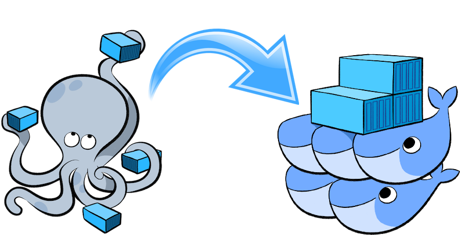
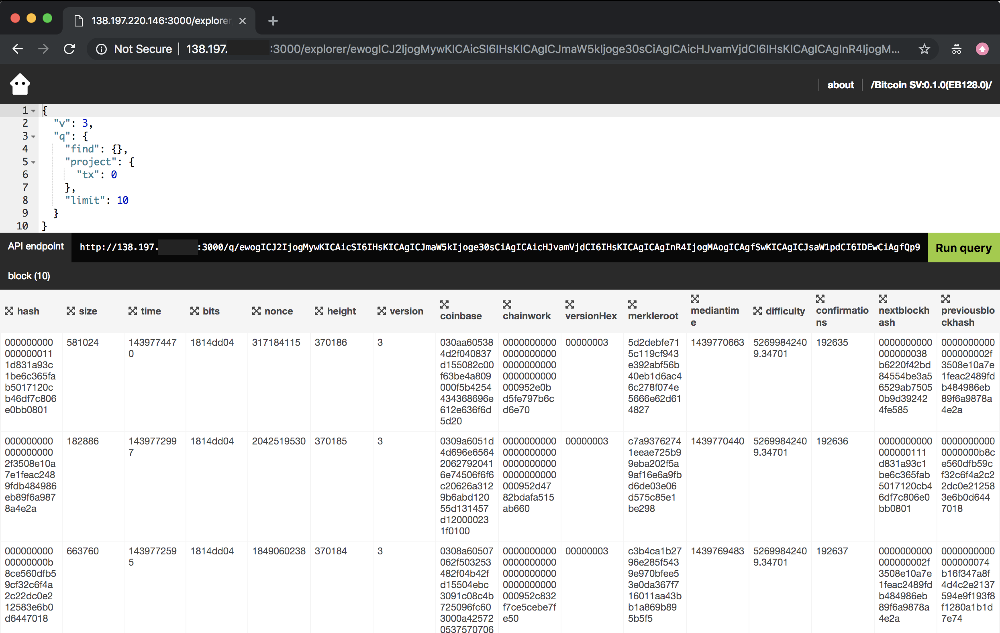

# Guide

The paradigm shift about Planaria's approach to building apps on top of Bitcoin is: it no longer matters who is running the backend.

The backend operator (Planaria node operators) acts as a utility provider, instead of having control over your data. This is because:

1. Everything on Planaria is derived from Bitcoin data.
2. The application logic itself is transparently published.

With this in mind, here are the options:

## Use Planaria

For most developers this is the way to go. You do not need to run a backend if there's someone else who's running one that you need.

Nobody has control over the backend because anyone can start running the same node with a single Docker command.

Think of Planaria nodes as decentralized database systems with a uniform query language protocol.

There is no single central service provider you must connect to, which means there is no central authentication system. Bitcoin is your authentication scheme. Planaria lets you authenticate using Bitcoin addresses you generate on your client side.

To access Planaria, let's start by installing the Planaria Computer, a utility that makes it easy to:

- Scaffold planaria apps
- Manage "API keys" (Bitcoin key pair)
- Manage Planaria containers
- Publish your planaria state machines
- Use existing Planaria state machines from the network

### 1. Install Planaria Computer

PC (Short for "Planaria Computer") is the command line utility for interfacing with Planaria.

<div class='center'>

</div>

Run the following command to install the NPM package globally.

```
npm install -g planaria
```

### 2. Generate a Bitcoin Keypair

With Planaria there is no "API Key" issued to you from a central admin. Instead you create an "account" by **generating a Bitcoin address key pair**.

The generated account (Bitcoin address) is your (decentralized) API key.


Let's create an account with PC:

```
pc new user
```

This will create a new Bitcoin key pair and store it under your home directory.

You can check the generated keys with:

```
pc ls user
```

Also if you look inside the file, you'll see that it stores both public key AND private key.

These address/public key/private key attributes don't do much at the moment (You just need to set the address as the header), but in the future will be used to:

1. Pay the node operators for service.
2. Communicate with the node operators.

without a middleman.

[Gif]


### 3. Connect to Planaria nodes

You can connect to various Planaria nodes by making HTTP[s] requests with your key as the header.

Browser:

```
<html>
<body>
<pre>loading...</pre>
<script>
var query = {
  v: 3,
  q: { find: {}, limit: 5 }
};
var b64 = btoa(JSON.stringify(query));
var url = "https://genesis.bitdb.network/q/1FnauZ9aUH2Bex6JzdcV4eNX7oLSSEbxtN/" + b64;

var header = {
  headers: { key: "1KJPjd3p8khnWZTkjhDYnywLB2yE1w5BmU" }
};

fetch(url, header).then(function(r) {
  return r.json()
}).then(function(r) {
  var result = JSON.stringify(r, null, 2);
  document.querySelector("pre").innerHTML = result;
})
</script>
</body>
</html>
```

Node.js

```
var axios = require('axios')
var query = {
  v: 3,
  q: { find: {}, limit: 5 }
};
var s = JSON.stringify(query);
var b64 = Buffer.from(s).toString('base64');
var url = "https://genesis.bitdb.network/q/1FnauZ9aUH2Bex6JzdcV4eNX7oLSSEbxtN/" + b64;

var header = {
  headers: { key: "1KJPjd3p8khnWZTkjhDYnywLB2yE1w5BmU" }
};

axios.get(url, header).then(function(r) {
  console.log("Fetched: ", r.data)
})
```

---

## Run a Planaria Node

There can be a couple of reasons why you may want to run your own Planaria node:

1. You have a novel state machine idea
2. You don't want to rely on any other node

### 1. Install

Before we get started, there are a couple of things we need to install.

#### A. Install Docker

<div class='center'>

</div>

If you don't have docker installed on your computer, you can follow the instructions here:  https://docs.docker.com/install/#supported-platforms

#### B. Install Docker-compose

<div class='center'>

</div>

You also need to install docker compose. Docker compose lets you manage multiple docker containers easily. Planaria runs on two core containers:

1. **Planaria:** Crawler + indexer
2. **Planarium:** Query processor + HTTP endpoint

So we need docker-compose to manage them. Follow the instruction here to install: https://docs.docker.com/compose/install/

#### C. Install Planaria Computer

<div class='center'>

</div>

Finally, install **Planaria Computer**. This tool does all the heavy lifting of generating, deploying, and managing planaria state machines.

```
npm install -g planaria
```

### 2. Create a New Machine

Let's create a new state machine.

```
pc new machine
```

This will walk you through a quick questionnaire and generate a project scaffold.

[Gif]


### 3. Start the Machine

When you create a new machine, by default it generates a [Genesis BitDB](https://medium.com/@_unwriter/genesis-a25b121e0575).

We can customize this later in the tutorial but for now lets just run the default.

```
pc start
```

You will be asked whether to join the Planaria network or not. You can say "No" if you want to run privately. The default is "Yes" (The whole point of Planaria is **transparent swarm computing**, which means all backends should be transparent and reproduceable, so being public is important).

You will see two containers starting up:

1. **Planaria:** The core crawler and indexer.
2. **Planarium:** The HTTP + SSE (Server Sent Events) API endpoint for interacting with Planaria.

[GIF]

You can check the log with `pc logs read`.

### 4. Use the Machine

Now we're all ready! Let's open up the browser and check.

[gif]

If you click the "query" button, you'll be sent to a Planarium explorer



If you click the "socket" buttono, you'll be sent to a Bitsocket explorer

[socket image]

### 5. Program your State Machine

Now that we've seen the default machine in action, let's try building our custom machine.

See [Programming Planaria](api?id=planaria-api) for details.

### 6. Deploy the Machine to Planaria Network

As mentioned, Planaria is ALL about transparency.

Unlike traditional clouds, a service based on Bitcoin MUST be 100% open and transparent. Otherwise your users won't be able to trust you.

This is why the main design principle of Planaria is **Transparency**.

The entire state machine can be programmed with a single JavaScript file, and you can publicly post it to the repository to share with the world, so your users will know which code is running in the backend.

To deploy to the planaria network registry, go into your `genes/[Address]` folder where all your files are, and:

```
pc push
```

### 7. Run an Existing Planaria Machine

Once a Planaria machine is stored on the [Planaria Network](https://planaria.network/), anyone can easily pull and run it.

All you need to do is:

```
pc pull [Address]
```

You can find the planaria Address at the top of every planaria page.

[image. screenshot]

Such ease of deploying and running someone else's machine is critical. It means 100% portable backend that will NEVER go away. By "never go away" I mean:

1. Even if the last person running the machine shuts it down, it's still not dead. Someone can pull the code 100 years from now and run it, and it will recreate the entire state by crawling the Bitcoin blockchain.
2. Even if one node goes down, if there are other nodes running on the same transparent planaria code, the API consumers can easily migrate to this new node.

---

## Build a Planaria Node

You can build your own planaria node.

Planaria Framework is made up of two components:

1. **Planaria:** The Bitcoin facing component
2. **Planarium:** The Human facing component

### 1. Build Planaria

> **[1. Programming Planaria](api?id=planaria-api)**

### 2. Build Planarium

> **[2. Programming Planarium](api?id=planarium-api)**
