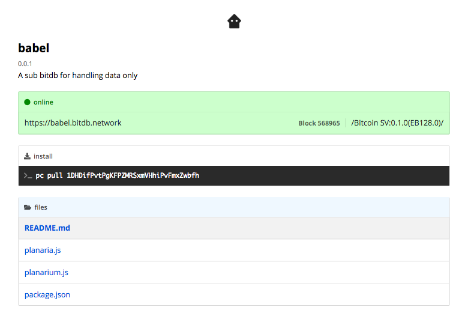
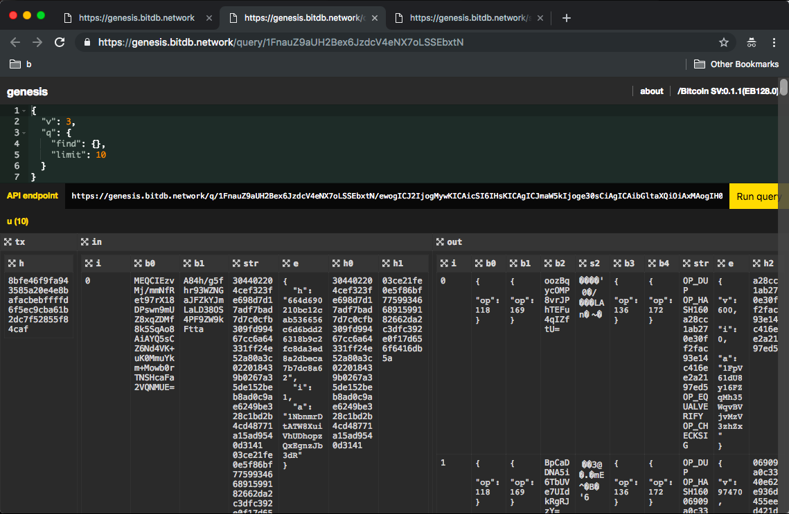
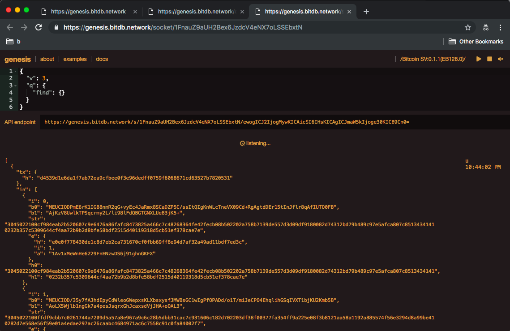
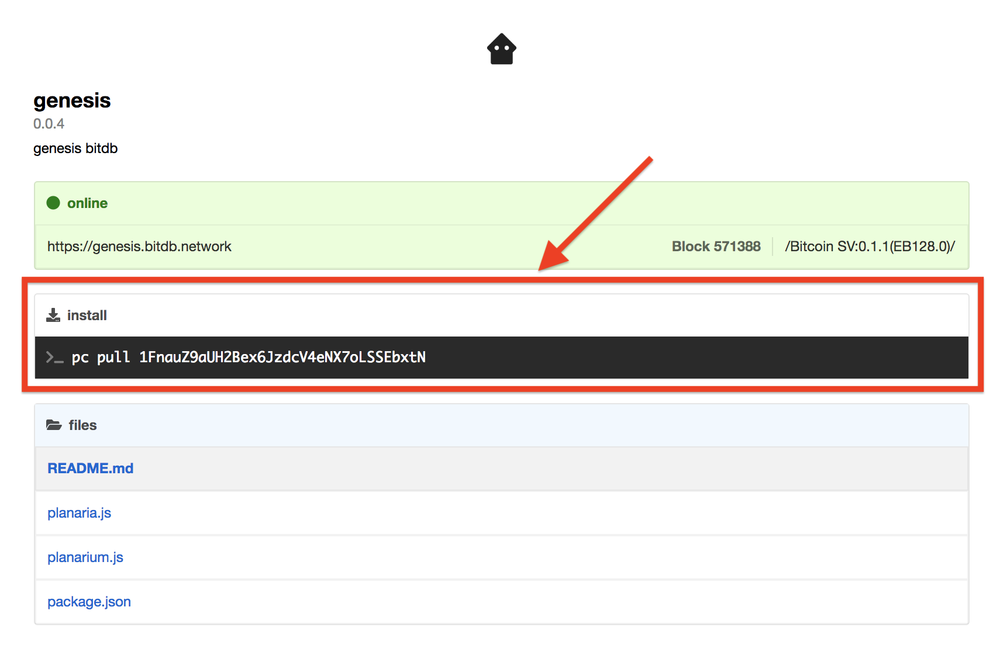
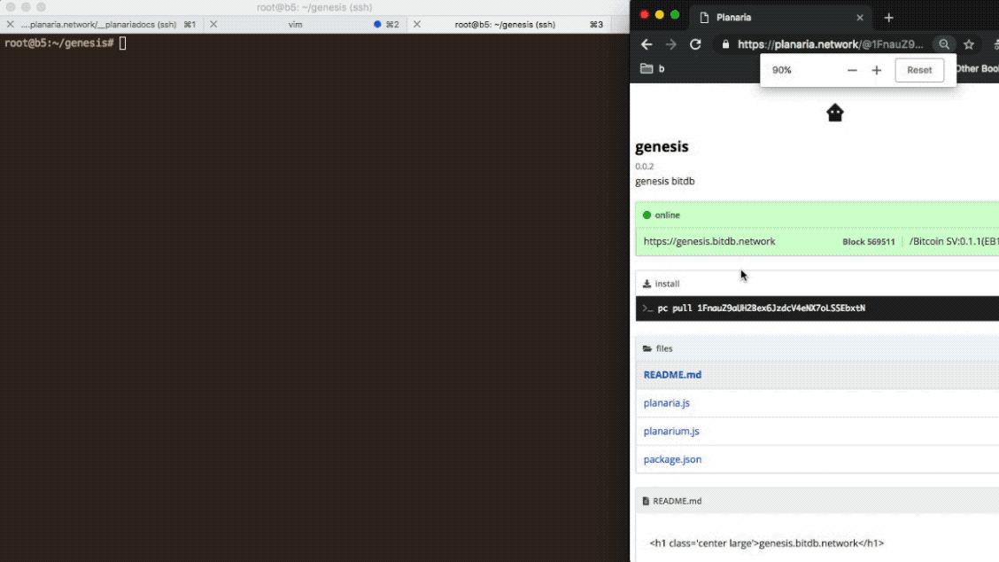
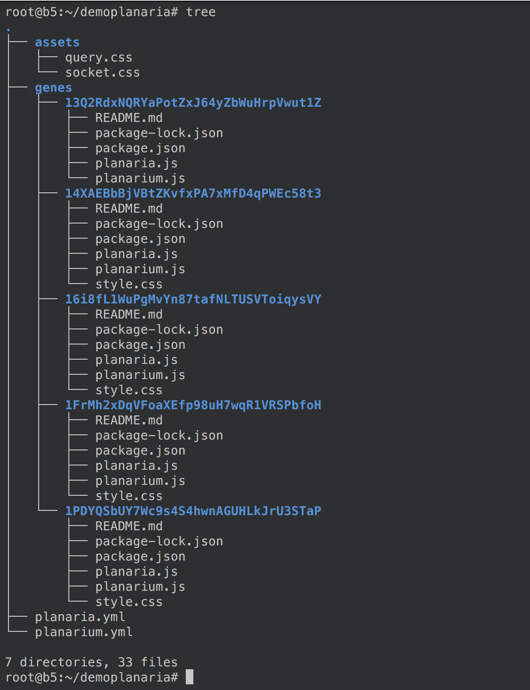
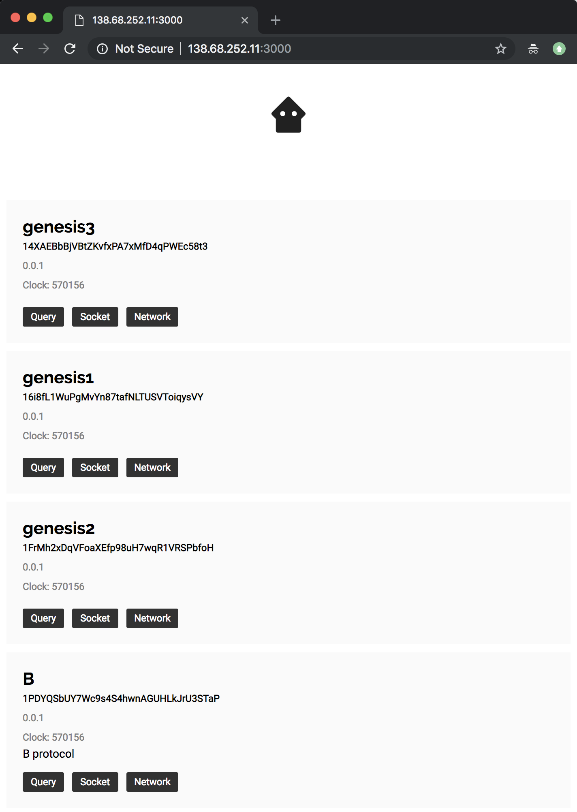

# Guide

The paradigm shift about Planaria's approach to building apps on top of Bitcoin is: it no longer matters who is running the backend.

The backend operator (Planaria node operators) acts as a utility provider, instead of having control over your data. This is because:

1. Everything on Planaria is derived from Bitcoin data
2. The application logic itself is transparently published

With this in mind, here are the options:

# A. Use a Node

For most developers this is the way to go. You do not need to run a backend if there's someone else who's running one that you need.

Nobody has control over the backend because anyone can start running the same node with a single Docker command.

Think of Planaria nodes as decentralized database systems with a uniform query language protocol.

There is no single central service provider you must connect to, which means there is no central authentication system. Bitcoin is your authentication scheme. Planaria lets you authenticate using Bitcoin addresses you generate on your client side.

## 1. Planaria Network

Planaria containers are published to the Planaria Network, where you can discover existing public nodes and connect to their APIs.



<a href='https://planaria.network' class='btn'>Visit Planaria Network ></a>

---


## 2. Planaria Computer

Planaria computer is a command line interface application that helps with:


- Scaffold planaria apps
- Manage "API keys" (Bitcoin key pair)
- Manage Planaria containers
- Publish your planaria state machines
- Use existing Planaria state machines from the network

<a href='/#/pc' class='btn'>Learn Planaria Computer</a>

---

## 3. Try

Try the Quickstart that lets you build a server-less application using an existing Planaria node:


<a href='/#/quickstart' class='btn'>Quickstart</a>

---

# B. Run a Node

There can be a couple of reasons why you may want to run your own Planaria node:

1. You have a novel API idea
2. You don't want to rely on any other node

## 0. System Prerequisites

- Minimum 2GB Memory (The more the better, depending on how much data you're trying to store in Planaria)
- Minimum 200GB space for storing the Bitcoin blockchain

## 1. Install

Before we get started, there are a couple of things we need to install.

### A. Install Bitcoin

Planaria sits on top of Bitcoin, therefore you need to have a Bitcoin node running.

---

**First,** download the Bitcoin SV node:

<a href='https://github.com/bitcoin-sv/bitcoin-sv/releases' class='btn'>Visit Bitcoin SV Node Download Page ></a>

After installation, check that Bitcoin is running and JSON-RPC is functioning correctly by trying the terminal command:

```
bitcoin-cli getblockchaininfo
```

If this returns a normal result, you're set to go!


---

**Second,** optimize your bitcoin node for Planaria:

- Higher RPC limit
- Zeromq broadcast setting
- RPC username and password setting

Here's an example `bitcoin.conf` file to get your Bitcoin node to work with Planaria:

```
# location to store blockchain and other data.
datadir=/Bitcoin
dbcache=4000
# Must set txindex=1 so Bitcoin keeps the full index
txindex=1

# [rpc]
# Accept command line and JSON-RPC commands.
server=1
# Default Username and Password for JSON-RPC connections
# Planaria uses these values by default, but if you can change the settings
# When you run 'pc start'
rpcuser=root
rpcpassword=bitcoin

# If you want to allow remote JSON-RPC access
rpcallowip=0.0.0.0/0
# [wallet]
disablewallet=1

# [ZeroMQ]
# ZeroMQ messages power the realtime Planaria crawler
# so it's important to set the endpoint
zmqpubhashtx=tcp://[YOUR SERVER IP]:28332
zmqpubhashblock=tcp://[YOUR SERVER IP]:28332

# Planaria makes heavy use of JSON-RPC so it's set to a higher number
# But you can tweak this number as you want
rpcworkqueue=512

# Support large mempool
maxmempool=6000

# Support large pushdata
datacarriersize=100000

# Long mempool chain support
limitancestorsize=100000
limitdescendantsize=100000
```


### B. Install Docker

<div class='center'>

</div>

If you don't have docker installed on your computer, you can follow the instructions here:  https://docs.docker.com/install/#supported-platforms

### C. Install Docker-compose

<div class='center'>

</div>

You also need to install docker compose. Docker compose lets you manage multiple docker containers easily. Planaria runs on two core containers:

1. **Planaria:** Crawler + indexer
2. **Planarium:** Query processor + HTTP endpoint

So we need docker-compose to manage them. Follow the instruction here to install: https://docs.docker.com/compose/install/

### D. Install Planaria Computer

<div class='center'>

</div>

Finally, install **Planaria Computer**. This tool does all the heavy lifting of generating, deploying, and managing planaria state machines.

```
npm install -g planaria
```

## 2. Create a New Machine

Let's create a new state machine. There are currently two ways to generate a machine:

1. Scaffold: Generates [Genesis](https://planaria.network/@1FnauZ9aUH2Bex6JzdcV4eNX7oLSSEbxtN)
2. Empty: Generates an empty Planaria project

### 1. Scaffold

If you just want to see something going instantly, try this. It indexes the entire [TXO](https://github.com/interplanaria/txo) format derived from every transaction, starting from height `525470`. [Learn more](https://planaria.network/@1FnauZ9aUH2Bex6JzdcV4eNX7oLSSEbxtN)

```
pc new genesis
```

### 2. Empty

To build your own custom Planaria, run the following command.

```
pc new machine
```

This will walk you through a quick questionnaire and generate an empty project with minimum skeleton required.


## 3. Start the Machine

When you create a new machine, by default it generates a [Genesis BitDB](https://medium.com/@_unwriter/genesis-a25b121e0575).

We can customize this later in the tutorial but for now lets just run the default.

```
pc start
```

You will be asked a couple of questions, some of which are:

> **Storage Path**

Enter the path to the folder you would like to store Planaria state inside. Planaria uses [Docker Volumes](https://docs.docker.com/storage/volumes/) to persist state.

Also, **XFS** is recommended (instead of **EXT4**) for storing Planaria state ([MongoDB works best with XFS](https://docs.mongodb.com/manual/administration/production-notes/#kernel-and-file-systems))

> **Memory in GB**

Enter the Memory you wish to allocate to the Planaria container.

To get the best performance for your server, use **(System RAM - 1GB)/2** ([as recommended by MongoDB](https://docs.mongodb.com/manual/reference/configuration-options/#storage.wiredTiger.engineConfig.cacheSizeGB))

> **Domain**

Enter the domain under which this container will run. This is for registring to the [Planaria Network](https://planaria.network).

Note that this domain will only show up on [Planaria Network](https://planaria.network) if the state machine is published to the registry using `pc push`.

> **Join the planaria network?**

You will be asked whether to join the Planaria network or not. You can say "No" if you want to run privately. The default is "Yes" (The whole point of Planaria is **transparent swarm computing**, which means all backends should be transparent and reproduceable, so being public is important)

You will see two containers starting up:

1. **Planaria:** The core crawler and indexer
2. **Planarium:** The HTTP + SSE (Server Sent Events) API endpoint for interacting with Planaria.


## 4. Use the Machine

Now we're all ready! Let's open up the browser and check. There are two buttons. 

### HTTP[S] Explorer

If you click the "query" button, you'll be sent to the HTTP[S] API Explorer:



### SSE Explorer

If you click the "socket" button, you'll be sent to the SSE API Explorer:



## 5. Program your State Machine

Now that we've seen the default machine in action, let's try building our custom machine.

See [Programming Planaria](https://docs.planaria.network/#/api?id=planaria-api) for details.

## 6. Deploy the Machine to Planaria Network

As mentioned, Planaria is ALL about transparecy.

Unlike traditional clouds, a service based on Bitcoin MUST be 100% open and transparent. Otherwise your users won't be able to trust you.

This is why the main design principle of Planaria is **Transparency**.

The entire state machine can be programmed with a single JavaScript file, and you can publicly post it to the repository to share with the world, so your users will know which code is running in the backend.

To deploy to the planaria network registry, go into your `genes/[Address]` folder where all your files are, and:

```
pc push
```

## 7. Run an Existing Planaria Machine

Once a Planaria machine is stored on the planaria.network, anyone can easily pull and run it.

All you need to do is:

```
pc pull [Address]
```

You can find the planaria Address at the top of every planaria page:



Here's what the process looks like:



Such ease of deploying and running someone else's machine is critical. It means 100% portable backend that will NEVER go away. By "never go away" I mean:

1. Even if the last person running the machine shuts it down, it's still not dead. Someone can pull the code 100 years from now and run it, and it will recreate the entire state by crawling the Bitcoin blockchain.
2. Even if one node goes down, if there are other nodes running on the same transparent planaria code, the API consumers can easily migrate to this new node.

## 8. Run Multiple Machines Simultaneously

You can even run multiple machines on a single node, simultaneously.

```
pc pull [ADDRESS]
```

Just pull multiple machines from the root folder, and they will all be installed under `genes/[ADDRESS]`:



When you start the node with:

```
pc start
```

and visit the Planarium root path, you'll see that all machines show up on the list:




---

# C. Build a Node

You can build your own planaria node.

Planaria Framework is made up of two components:

1. **Planaria:** The Bitcoin facing component
2. **Planarium:** The Human facing component

## 1. Build Planaria

Learn how to program the Bitcoin-facing crawler + indexer:

<a href='/#/api?id=planaria-api' class='btn'>Programming Planaria</a>

## 2. Build Planarium

Learn how to program the API endpoint (HTTP[s] + SSE)

<a href='/#/api?id=planarium-api' class='btn'>Programming Planarium</a>
