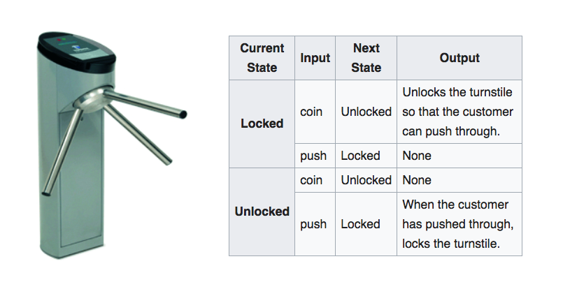
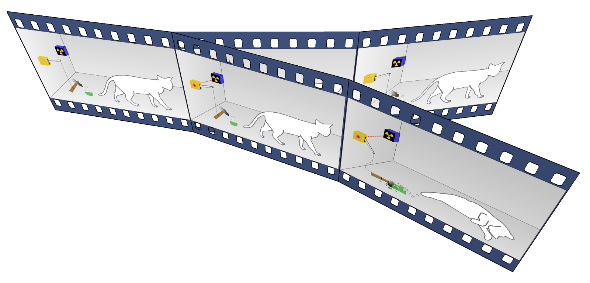
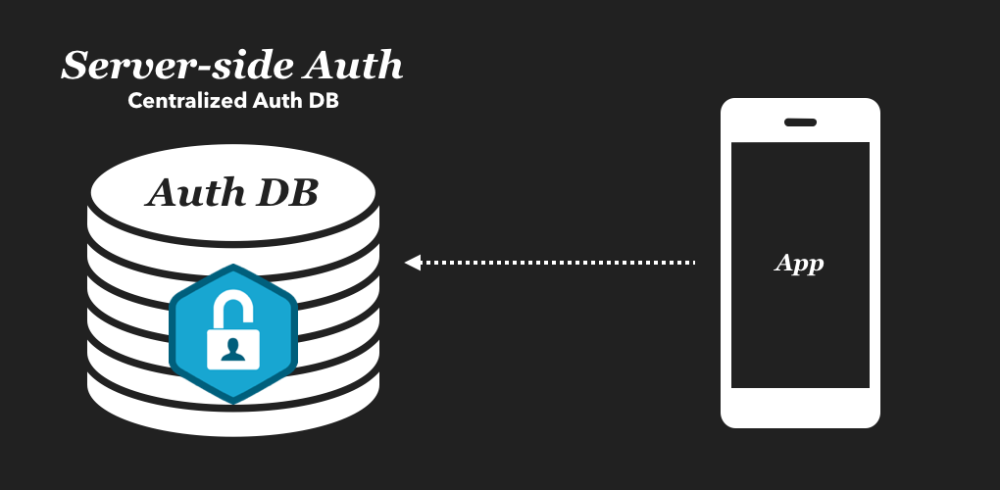
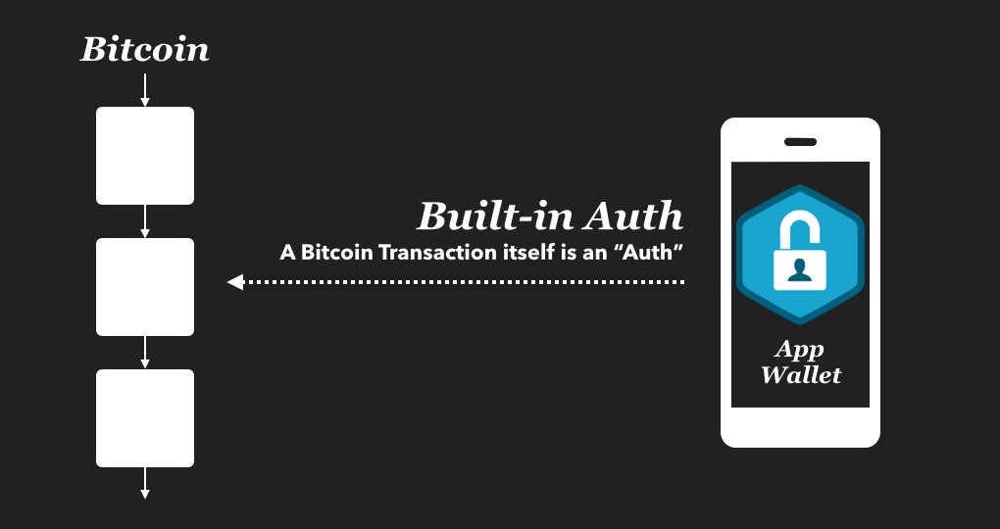
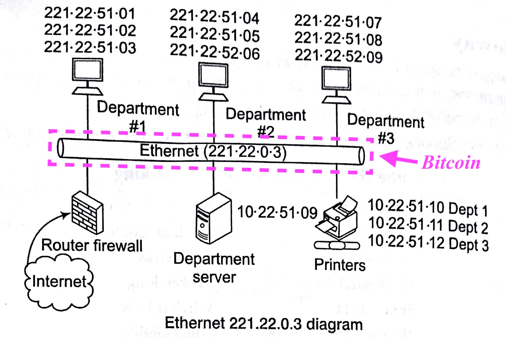
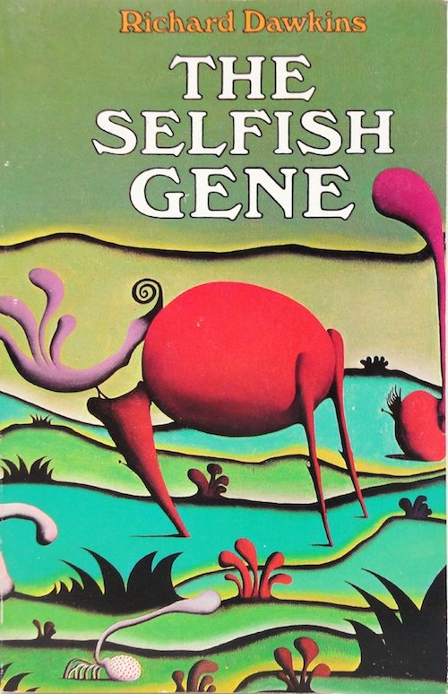

# Introduction

Planaria is based on a different way of thinking about Bitcoin than just "Money".

This page will explain the design philosophy first, followed by an actual explanation of how Planaria works.

## Bitcoin

Let's think of Bitcoin as a perpetual rotating machine, an infinity motor.


This "motor" travels through time and collects all the events (**transactions**) that happen through each rotation and takes an immutable snapshot (**a block**).


The rotation logic (Bitcoin's algorithm) is deterministic and secure (powered by Proof of Work), making it the perfectly stable piece of technology to power all kinds of useful machines.


## Machine

Now that we've set the context for:

```
Bitcoin == Motor
```

We can think about how to build a machine with a motor (Bitcoin). But first, what exactly is a **"machine"**?

A machine is a **function**. A machine takes the motor as the constant source of energy and **transforms the energy into various forms that can be consumed by humans or other machines**.


```
Machine = F(Motor)
```


Notice that the "motor" is rotating in a constant manner in all three graphs, yet we end up with multiple distinct wave forms (**features**) derived from different shapes (**machines**).

> This is the main idea behind Planaria:
>
> **You can create infinite number of "machines" from a single reliable motor, which is Bitcoin.**


## Finite State Machine

Planaria lets you build state machines. So what is a state machine?

> ... is an abstract machine that can be in exactly one of a finite number of states at any given time. The FSM can change from one state to another in response to some external inputs; the change from one state to another is called a transition. An FSM is defined by a list of its states, its initial state, and the conditions for each transition.

A simple way to put it: Every "machine" we use on a daily basis is some form of a state machine. For example, a subway turnstile is a "state machine" because it can have multiple states and reacts to external "input" to produce an "output":



If you can model a state machine using nothing but Bitcoin, it is possible to implement ANY kind of real world machine.

And that's what Planaria is.


## Infinite State Machine

Being able to build state machines from Bitcoin is already extremely powerful. You can build ANY real-world application using Bitcoin as backend. However, with Bitcoin we can go further.

**we can build applications that are NOT constrained by resources.**

We can build machines that:

- are running and not running at the same time.
- don't have to exist nor run today, yet can be regarded as "running" today.
- can have multiple parallel states that even contradict with one another.
- never die, even when they are not alive.
- can interact with one another in non-deterministic ways.
- can interact with one another in combinations which even its original inventors never foresaw.
- spawn other such machines without external intervention.


**Planaria views Bitcoin as the "motor" instead of a "machine".**

> **Note:**
>
> Planaria will become even more powerful once the Bitcoin script limits are gone, we will be able to implement various finite state machines on Bitcoin only with Bitcoin Script, and Planaria will be able to help the outside world interact with them easily.

---


## Planaria

There are many ways to describe what Planaria is, because it can mean different things for different people.

### 1. Bitcoin Application Framework

Are you familiar with application frameworks like [Ruby on Rails](https://en.wikipedia.org/wiki/Ruby_on_Rails), [Django](https://en.wikipedia.org/wiki/Django_(web_framework)), [Laravel](https://en.wikipedia.org/wiki/Laravel), [Spring](https://en.wikipedia.org/wiki/Spring_Framework), etc.?

**Planaria is like these frameworks, but for Bitcoin, where you can write apps with nothing but JavaScript.**


> If you're already familiar with [Bitdb](https://bitdb.network) or [BitSocket](https://bitsocket.org), Planaria is basically a framework for building your own BitDB and Bitsocket.
>
> All existing variations of BitDB ([Genesis](https://medium.com/@_unwriter/genesis-a25b121e0575), [Babel](https://medium.com/@_unwriter/babel-230f73ed5dcb), [Chronos](https://medium.com/@_unwriter/chronos-f0f751669fef), [Meta](https://medium.com/@_unwriter/meta-be3c18582ec7)) are Planaria nodes.

Because it's powered by Bitcoin, it has various unique traits we've never seen in traditional centralized cloud paradigm:

1. **Transparent:** Because all data is derived from Bitcoin in a transparent manner, you can be sure that the resulting machine acts as designed. Furthermore, anyone can verify themselves by pulling and running a node, with just a few simple commands.
2. **Portable:** All planaria machines are **containerized** and can be **published as a single portable Node.js module**, which means anyone else can take the published code and run exactly the same state machine as you.
3. **Shareable:** There is no value in one organization owning an entire backend because everything is derived from public data and public algorithm transparently stored on Bitcoin. Backends can and will outlast the original creator.
4. **Customizable:** There is no limit to how much you can customize Planaria. You can even mix it with external event producers and APIs to build a novel backend powered by Bitcoin.
5. **User Friendly:** Unlike most nerdy tech that makes you jump through all kinds of hoops to implement "decentralization", Planaria lets you interact with Bitcoin like it's just a regular CRUD database with an HTTP API.

Also it ships with a **command line interface tool called [Planaria Computer](http://localhost:3000/#/serve?id=get-started)**, which makes this even easier by letting you scaffold and spawn up these backends with just a couple of commands.

### 2. Autonomous CRUD Database


Technically, Planaria is:

- a containerized MongoDB instance
- that exposes a programmable CRUD API
- that can ONLY be called by Bitcoin.

Because ONLY Bitcoin can write to the database, **there is no "user write API"**. So building a Planaria node means you write a program that Bitcoin follows to write to the database. Here's how it works:

1. **Bitcoin Events as Input:** The entire stack is 100% based on Bitcoin's state. Everything is **verifiably** derived from the Bitcoin blockchain.
2. **Write Bitcoin apps in Node.js:** As a Planaria node developer, you can write a program that dictates how the container will autonomously detect various Bitcoin events and turn them into database CRUD actions.
2. **Stores states in MongoDB:** Planaria maintains custom state in its MongoDB instance. Planaria node developers can build a node by writing a program that does this.


Because all database systems can be reproduced this way, simply using the event + transition logic, we can build ANY mutable database using Bitcoin.

Planaria provides a **CRUD (Create Read Update Delete)** API for this, so anyone can easily build their own custom Bitcoin-derived database.

### 3. Bitcoin-Derived State Machine

Every Planaria is a state machine, powered by Bitcoin.


- **Input:** An event listener that listens to realtime events and states from Bitcoin.
- **Transition Logic:** A program that handles state transition (Using the CRUD API).
- **State Memory:** A "memory" to persist and update the state (MongoDB).
- **Output Logic:** An event producer that publishes custom programmable events for other modules and SSE.


#### Input

The Planaria framework provides a set of API methods (`onmempool`, `onblock`, `onrestart`) which let you listen to various event types and run custom code to handle the events.

#### Transition Logic

The Planaria framework provides a set of CRUD API methods that let you write state transition logic (`create`, `read`, `update`, `delete`) very easily, without you having to worry about all the behind-the-scenes details (such as bulk write operations).

#### State Memory

Planaria ships as a set of **two Docker containers** (`planaria` and `planarium`). The `planaria` container is the crawler/indexer component that writes to the **containerized MongoDB instance** using the transition logic api from above. The `planarium` container is an HTTP + SSE API endpoint that reads from the same shared MongoDB.

#### Output Logic

Planaria also lets you write logic to broadcast your own zeromq events for other modules to subscribe to.

This includes the `planarium` container which automatically turns the Zeromq publish into an SSE (Server Sent Events) API, which users can subscribe to using Bitquery.


### 4. Infinite State Machine

Here's the most powerful part about Bitcoin: You can **build eternal machines that are NOT bound by resources**.

> **An entirely new class of application, only made possible through the very precise minimal architecture of Bitcoin, and Bitcoin only.**

You can build machines that:

1. Can simultaneously exist as multiple parallel states.
2. Don't have to be running and validating at all times, yet still exist forever.
3. Can transcend time and space.
3. Can spawn descendants and evolve.

As a thought experiment, let's imagine building a [Schrödinger's cat](https://en.wikipedia.org/wiki/Schr%C3%B6dinger%27s_cat) on Bitcoin.



Essentially we want to create a self-contained system that:

- has a single static event stream
- but with infinite dynamic interpretations (functions)

It is infeasible to build this system in any existing system, because  if we have to run all of them simultaneously. Especially if it means running them on-chain. We are bound by resources.

However, what if we can:

- provably "publish" an application
- but don't have to run them all simultaneously,
- yet later on run them as if they have been running all along?

Thanks to **containerization** and **application portability**, this is possible with Bitcoin (through Planaria).

Running a node is as easy as a few commands, and all machines are transparently published, which means anyone can run the same code to verify other people's computations.


## Understanding the New Paradigm

Building an application on Bitcoin requires rethinking of a lot of things we take for granted in the old paradigm of centralized clouds.


### Decentralized AUTH

#### Old Model

In a traditional cloud model, one of the most important tasks the server provides is authentication and authorization. This is why it is very difficult for applications to be portable. This is why when one company goes down, its apps go down along with it.



#### New Model

With Bitcoin, the authentication is taken care of on the protocol level, on the edge. YOU have the keys to every single "API request" you make. This means we no longer need a central authority that stores and takes care of authentication & authorization details.

**Thanks to the built-in signature in EVERY Bitcoin transaction, every "database entry" on Planaria is authenticated by default, in a SELF-CONTAINED manner.**

> **Applications no longer need a separate proprietary private authentication database.**



> How Planaria fits into the picture:
>
> **Planaria doesn't deal with AUTH at all.** It assumes users will be interacting with Bitcoin through various great "WRITE" methods such as wallets or app frontends, and **focuses ONLY on the READ part**.

---

### Unbundling of READ & WRITE

In a traditional cloud paradigm, a central server takes care of both WRITEs and READs.


You make POST requests to write data to the server, and make GET requests to read data from the server. If the server bans you, you no longer exist in that world because there is no way to WRITE to the world.

**Bitcoin changes this paradigm. The WRITES are unbundled from READ.**

You can still READ through GET requests from HTTP endpoints, but this time, WRITE is done through your Bitcoin wallet. Because of this, nobody can stop you from WRITING to Bitcoin.


> How Planaria fits into the picture:
>
> **Planaria is READ ONLY**. The idea is that there will be all kinds of great contextual methods of WRITING to the blockchain, so Planaria stays minimal and only focuses on READ.


---

### Autonomous Applications

Another important distinction is you can build **autonomous applications that can live on WITHOUT an owner**.


Traditionally an inventor would create an application AND maintain it. But when they stop running the app, they would just shut down and move on (or open source the code if they REALLY cared).

In either cases, the most important part--the state--is either thrown away or sold away to another entity. It's easy to replicate the code, but the state is a result of time, and time can't be replicated easily. This is why most applications come and go, even when there exist many people who would like to keep using these applications.

**This changes when you power your application with Bitcoin.**

The entire app state is public by default, and Planaria makes it easy to publish and deploy them in a matter of seconds. This means applications and their users don't have to worry about the destiny of the creator and maintainer.

> How Planaria fits into the picture:
>
> **Planaria lets you write the types of apps described in this section**. All you need to do is write a Planaria node program, and deploy the code itself to the blockchain.

---

### Bitcoin as Message Bus

Bitcoin is the **ONLY technology in existence that can facilitate TRULY autonomous applications at scale**.



1. **Minimalism:** [Bitcoin's minimal UTXO data structure makes it THE MOST scalable technology ever](https://twitter.com/_unwriter/status/1032674099796082688). **Bitcoin is the minimum possible data structure to store any kind of event. You can't go more minimal than Bitcoin. And it is possible to derive ANY state from events.** All other approaches of trying to store more redundant data will cost more than Bitcoin therefore inferior. And the [economies of scale](https://en.wikipedia.org/wiki/Economies_of_scale) will make sure that one superior open technology will win in the long term.
2. **[End-to-End Principle](https://en.wikipedia.org/wiki/End-to-end_principle):** It is well known that protocols should be as minimal as possible and expect the edge to handle the details. This is the very principle on which the Internet itself was designed. And this is how Bitcoin works. And this is why it works.
3. **[No Human Politics Involved](https://en.bitcoin.it/wiki/Proof_of_work):** Bitcoin gets rid of human politics. Because of the Proof of Work system that powers Bitcoin, there is no room for human politics. Bitcoin is the ONLY technology that operates at scale with this model. Everything else is or has moved to utilizing a concept called "Stake", also known as politics.

**Bitcoin is the only pure global message bus technology in existence that is free from human politics and corruption.**

And this is what Planaria lets you build.

---

### Transparent Computing

Because Planaria derives everything from Bitcoin, every aspect of a Planaria powered application is transparent.

We can think of each Planaria node as **a pure math function that derives output from Bitcoin as input.**


Furthermore, once you upload even the Planaria node logic itself to the blockchain, we can achieve total transparency, because:

1. The state machine code is public (Because it's stored on the blockchain).
2. The state is public (because it's 100% derived from Bitcoin).
3. Anyone can instantly pull, deploy, and run the node themselves to verify.

---

### Immortal Machines

One problem with the centralized cloud model of application architecture is that **In the long run they are all dead**.

The destiny of an application is 100% dependent on the destiny of its host. Bitcoin gives us a way to change this, and Planaria implements it.

The core philosophy of Planaria is that it views an application NOT as an organism, but as a gene. And [genes are immortal](https://www.nature.com/articles/529462a).



Every Planaria node is made up of two minimal components:

1. **Input:** Bitcoin events (100% from Bitcoin)
2. **State Transition Logic:** This is the "gene". You can write a program that describes how a state machine would behave, and store it on the blockchain.

And thanks to the containerized architecture (Powered by Docker), ANY planaria application can be instantly recreated from scratch, simply by pulling the "gene" from the network and starting.

---
