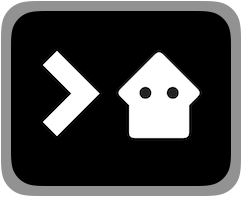

# Planaria Computer

Planaria Computer is a command line interface for

- Scaffolding planaria apps
- Managing Bitcoin keypairs as API keys
- Managing Planaria containers
- Publishing your planaria state machines
- Pulling and deploying existing Planaria state machines from the network


# Install

Planaria Computer is an NPM Package. You can install it globally by running:

```
npm install -g planaria
```


---

# User Commands

## 1. new

Create a new user.

```
pc new user
```

## 2. ls

List user accounts.

```
pc ls user
```

---

# Machine Commands


> IMPORTANT: ALL commands in this section (except for `pc push`) MUST be run from the root folder. [Learn more about the app folder structure](#app-structure)


## 1. new

### Prerequisite

Before creating a new node, you need to create a host folder.

```
mkdir app
```

Then cd into the folder.

```
cd app
```

### create a genesis machine

To try a default Planaria which contains all the available attributes, generate a new machine with:

```
pc new genesis
```

### create an empty machine

Create an empty new project with:

```
pc new machine
```

You will be presented with a short questionnaire.

Once you finish the questionnaire, the command will auto-generate all the files required to run a planaria node:

### Store your keys

When you create your machine, an `.env` file will be created under the gene folder (The same folder where the `planaria.js` and `planarium.js` exist)

The `.env` file will contain:

- the generated Bitcoin Address
- public key
- private key

Make sure to open the `.env` file, copy and store it somewhere else as well, just in case.

The private key is what proves you own the Planaria machine code, so if you lose the private key, there's no way to prove you created the machine.

> Note: Each gene folder contains its own `.env` file, which means you will have multiple `.env` files if you run multiple Planaria machines under the same node.


Now you're ready to start!


---

## 2. start

Start a node

1. Start Planaria
2. Start Planarium
3. Start All

### Start Planaria

Planaria is the "Write" interface. Here's how to start a Planaria container:

```
pc start write
```

### Start Planarium

Planarium is the "Read" interface. Here's how to start a Planarium container:

```
pc start read
```

### Start all

You can start both Planaria and Planarium with a simple command:

```
pc start
```

This will start Planaria first, and then Planarium.

---


## 3. stop

Stop a node

1. Stop Planaria
2. Stop Planarium
3. Stop All

### Stop Planaria

Planaria is the "Write" interface. Here's how to stop a Planaria container:

```
pc stop write
```

### Stop Planarium

Planarium is the "Read" interface. Here's how to stop a Planarium container:

```
pc stop read
```

### Stop all

You can stop both Planaria and Planarium with a simple command:

```
pc stop
```

This will stop Planarium first, and then Planaria.

---

## 4. restart

Restart a node.

You may want to use `restart` if you already have a running node and restart with a single command

1. Restart Planaria
2. Restart Planarium
3. Restart All

### Restart Planaria

Restart Planaria

```
pc restart write
```

### Restart Planarium

Restart Planarium

```
pc restart read
```

### Restart all

Restart both Planaria and Planarium

```
pc restart
```

---

## 5. logs

Display logs. A convenience method for `docker logs` for Planaria/Planarium containers.

### Planaria Logs

Start watching Planaria (write) logs. Displays last N lines of Planaria container logs, and starts watching.

```
pc logs write [LINES]
```

You can also just enter the following to start watching from the last 1000 lines (default)

```
pc logs write
```


### Planarium Logs

Start watching Planarium (read) logs. Displays last N lines of Planarium container logs and starts watching.

```
pc logs read [LINES]
```

You can also just enter the following to start watching from the last 1000 lines (default)

```
pc logs read
```

> Internally this is just a convenience method for `docker logs -f [CONTAINER_ID] --tail [LINES]`. After all, everything is a docker container so you can just use the docker commands

---

## 6. rewind

Rewind time to right before the specified height

```
pc rewind [height]
```

Above command will:

1. Stop all containers (First `Planarium`, and then `Planaria`)
2. Rewind Planaria's clock to `height`
3. Restart Planaria, which will execute [onrestart](api?id=onrestart)

> **Of course, you will have to implement the `onrestart` method to handle the rewind, such as cleaning up all the relevant items after the `height`, and resetting the clock.**


---


## 7. push

Push the current machine

```
pc push
```

You must run the command inside the `genes/[ADDRESS]` folder, since you are pushing each "gene" to the registry, and not the entire node.

> **NOTE: One node can run multiple "genes" (Planaria machines).**


---

## 8. pull

Run the command from the root folder:

```
pc pull [ADDRESS]
```

> **NOTE: You can pull (and run) as many machines as you want from a single node, simultaneously.**


---

## 9. update

Update the Planaria and Planarium images

1. Update Planaria
2. Update Planarium
3. Update All

Recommended: run update after stopping the containers.

### Update Planaria

Update Planaria to the latest stable image

```
pc update write
```

### Update Planarium

Update Planarium to the latest stable image

```
pc update read
```

### Update all

Update both Planaria and Planarium to the latest stable image

```
pc update
```


---

# App Structure

If you are running multiple Planaria state machines on the same node, you need to make sure you structure the code properly.

- There is a root folder named `genes`
- Each machine has its own address space under the `genes` folder, identified by its unique Bitcoin address.
- When you run a node with multiple genes, it will execute the `planaria.js` code for every gene it contains.


Here's the folder structure:


**This means ALL the `pc` commands from above MUST be run from the root folder.**


For example, if you run `pc new machine` multiple times from the root folder, you will find that your `genes` folder will have gained multiple genes, all identified with a unique Bitcoin address.

Also, if you pull from the planaria network, you can do `pc pull [Address]` from the **root folder**. This will also update the `genes` folder.

> The ONLY exception for `pc` command execution is when you push to the [planaria.network](https://planaria.network) registry. In this case you run `pc push` from the actual gene folder you want to push.

---

# Reset the Entire Node

Sometimes you may want to reset the entire node and start over. In this case you can try the following:

First, stop the containers:

```
pc stop
```

Second, prune all Docker related stuff:

```
docker system prune --volumes
```

Third, delete the volume. If you were using `./db` to store the Planaria state, you can run:

```
rm -rf ./db
```

Delete the File Serve API folder and File System API folder.

Assuming we've been storing them under `./assets` and `./fs`,

```
rm -rf ./assets
rm -rf ./fs
```

---
