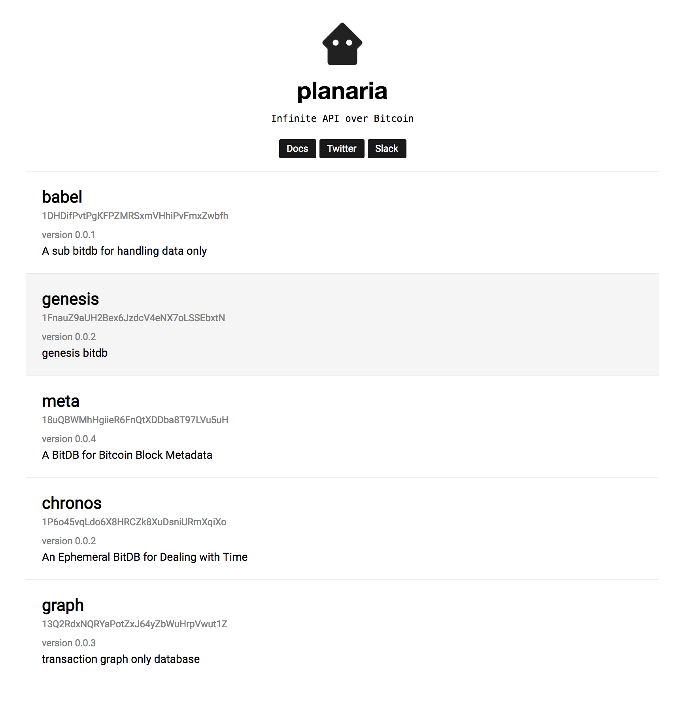
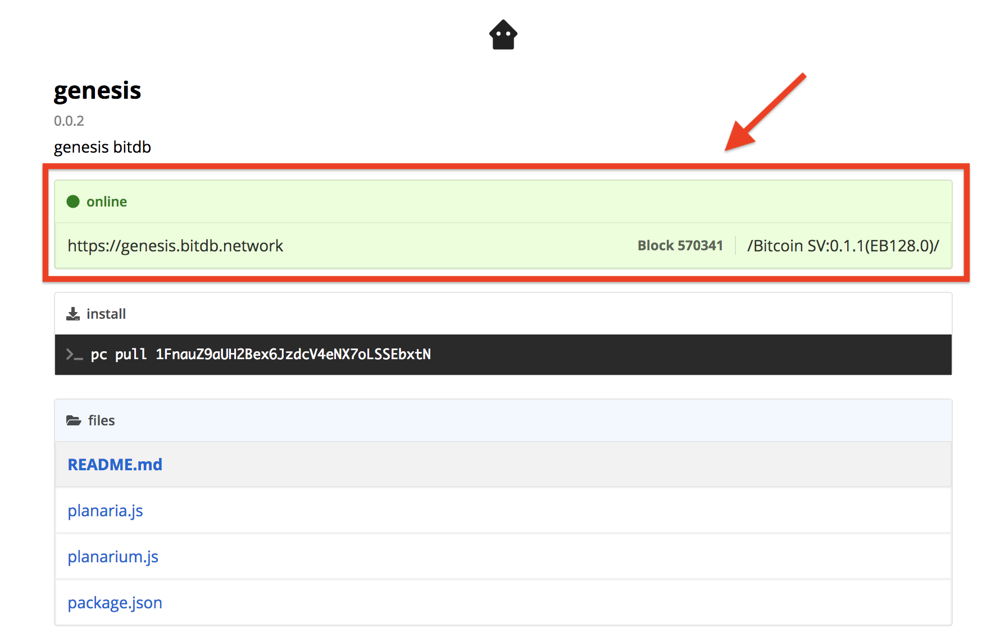
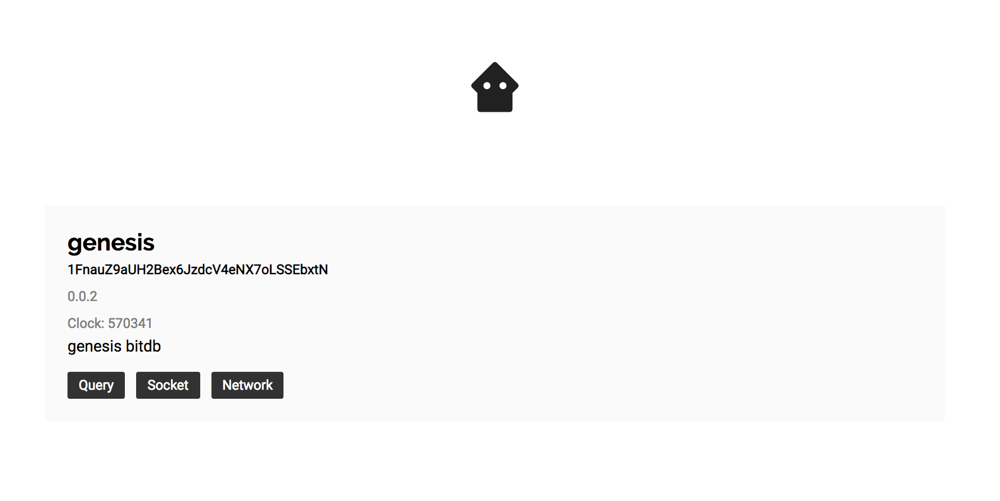
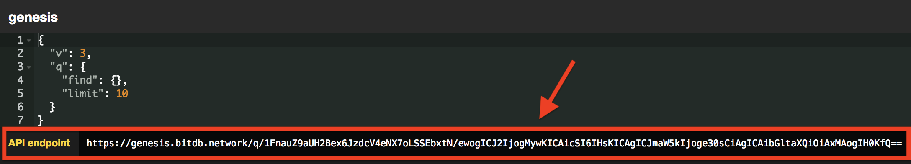

# Quickstart

You can think of a Planaria node as a **backend**. This means there are two things you can do with Planaria:

1. Build a server-less application by connecting to an existing Planaria node
2. Run your own specialized Planaria backend as a service

Here we will discuss the former: **Building applications**. This is recommended for most people unless you have a novel idea for a Planaria node.


## 1. Install Planaria Computer

First, install PC (Short for "Planaria Computer"), the command line utility for interfacing with Planaria:

```
npm install -g planaria
```

## 2. Generate a Bitcoin Keypair

To connect to various Planaria nodes, you need to identify yourself with a Bitcoin address. You can generate one using PC:

```
pc new user
```

This will create a new Bitcoin key pair and store it under your home directory. You can check the generated keys with:

```
pc ls user
```

## 3. Pick a Planaria Node to Connect to

Thanks to the flexibility, one can build and launch ANY kind of API Microservice in a matter of minutes.


### A. Discover

The [Planaria Network](https://planaria.network) website is a website where you can:

1. **Publish Planaria Virtual Machines:** publish the code
2. **Discover Planaria Virtual Machines:** discover and instantly pull the code to run
3. **Discover Planaria Public Nodes:** discover online public nodes you can connect to as an app developer.

In this tutorial, we will be building an app, and will pick an existing node named [Genesis](https://genesis.bitdb.network) (We'll learn how to run a node ourselves later)



### B. Find Public Node

The [Planaria Network](https://planaria.network) website is a repository, but it also lets node operators publish their online status to let developers connect to their API endpoint.

When there's an online public node that's running a specific Planaria machine, you will see the green box at the top.

Click a node to visit the node dashboard.



### C. Get API Endpoint

The node dashboard would look like this:



Click the `query` button to visit the Query explorer.

When you visit the query explorer, you will see the "API Endpoint" area. Copy up to the `https://genesis.bitdb.network/q/1FnauZ9aUH2Bex6JzdcV4eNX7oLSSEbxtN` part. This is the root path of the API.



> The part after `/q/` is a Bitcoin address.
>
> It's used to uniquely identify each Planaria state machine withouth relying on a central server.

## 4. Make HTTP[s] Requests

Now you're ready to connect to Planaria nodes. You can make HTTP[s] requests with your "API KEY" generated from [Step 2](https://docs.planaria.network/#/quickstart?id=_2-generate-a-bitcoin-keypair)

Browser:

```html
<html>
<body>
<pre>loading...</pre>
<script>
var query = {
  v: 3,
  q: { find: {}, limit: 5 }
};
var b64 = btoa(JSON.stringify(query));
var url = "https://genesis.bitdb.network/q/1FnauZ9aUH2Bex6JzdcV4eNX7oLSSEbxtN/" + b64;

var header = {
  headers: { key: "1KJPjd3p8khnWZTkjhDYnywLB2yE1w5BmU" }
};

fetch(url, header).then(function(r) {
  return r.json()
}).then(function(r) {
  var result = JSON.stringify(r, null, 2);
  document.querySelector("pre").innerHTML = result;
})
</script>
</body>
</html>
```

Node.js

```javascript
var axios = require('axios')
var query = {
  v: 3,
  q: { find: {}, limit: 5 }
};
var s = JSON.stringify(query);
var b64 = Buffer.from(s).toString('base64');
var url = "https://genesis.bitdb.network/q/1FnauZ9aUH2Bex6JzdcV4eNX7oLSSEbxtN/" + b64;

var header = {
  headers: { key: "1KJPjd3p8khnWZTkjhDYnywLB2yE1w5BmU" }
};

axios.get(url, header).then(function(r) {
  console.log("Fetched: ", r.data)
})
```


## 4. Subscribe to SSE (Server Sent Events)

You can also write the same query to listen to a specific pattern of events from Planaria.

Browser:

```html
<html>
<body>
<script>
var query = {
  "v": 3, "q": { "find": {} }
}
// Base64 encoded query
var b64 = btoa(JSON.stringify(query))
// Subscribe to EventSource
var url = "https://genesis.bitdb.network/s/1FnauZ9aUH2Bex6JzdcV4eNX7oLSSEbxtN/" + b64;
var socket = new EventSource(url)
// Handle new messages
socket.onmessage = function(e) {
  document.write("<pre>" + JSON.stringify(JSON.parse(e.data), null, 2) + "</pre>")
}
</script>
</body>
</html>
```

Node.js:

```javascript
var EventSource = require('eventsource')
var query = {
  "v": 3, "q": { "find": {} }
}
var b64 = Buffer.from(JSON.stringify(query)).toString("base64")
var socket = new EventSource('https://bitsocket.org/s/'+b64)
socket.onmessage = function(e) {
  console.log(e.data)
}
```

---

## 5. Where to Go from Here

We've only looked at the **"how to use"** part. From here you can:

1. Use Existing Planaria APIs to Build Apps
2. Build Your Own Planaria APIs

### Use Existing Planaria APIs to Build Apps

Browse Planaria Network to find some Planaria nodes you can connect to:

<a href='https://planaria.network' class='btn'>Planaria Network</a>

Learn More about the Query Language:

<a href='/#/query' class='btn'>Learn Bitquery</a>

Learn More about Bitsocket (The SSE API)

<a href='https://bitsocket.org/' class='btn'>Learn Bitsocket</a>


Learn More about some notable Planaria nodes:

<a href='https://medium.com/@_unwriter' class='btn'>Read Tutorials</a>

### Build Your Own Planaria APIs

Learn why you may want to build your own Planaria API:

<a href='/#/use' class='btn'>Planaria Use Cases</a>

Learn how to run your own node:

<a href='/#/guide?id=b-run-a-node' class='btn'>Run Your Node</a>

Learn how to program a Planaria state machine that can be deployed to a node:

<a href='/#/api' class='btn'>Programming Planaria Machine</a>

