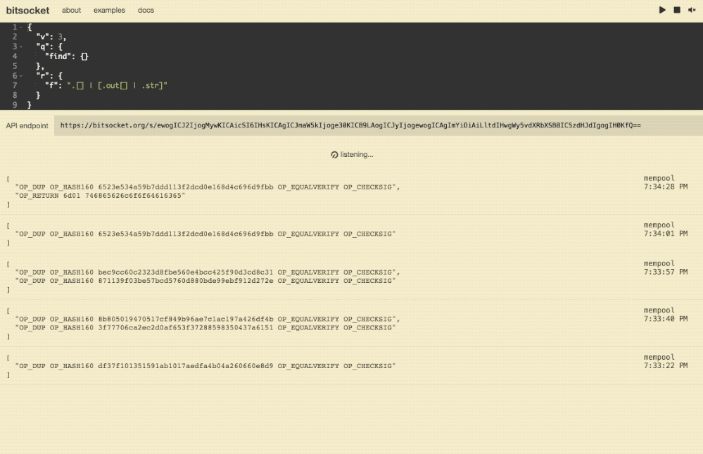
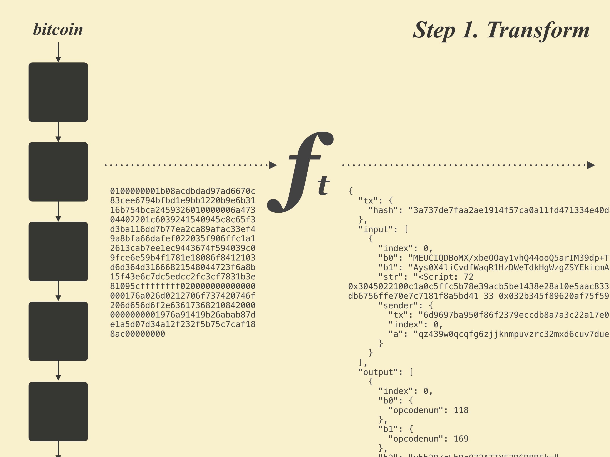
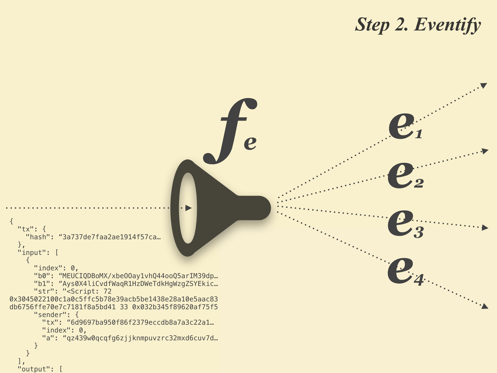
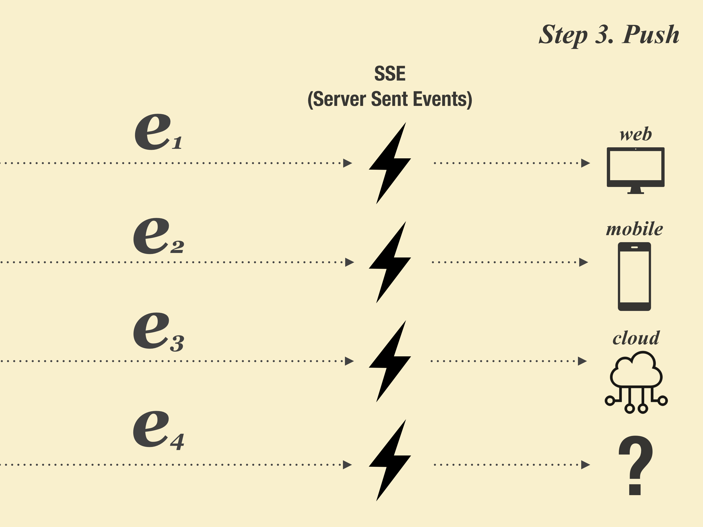
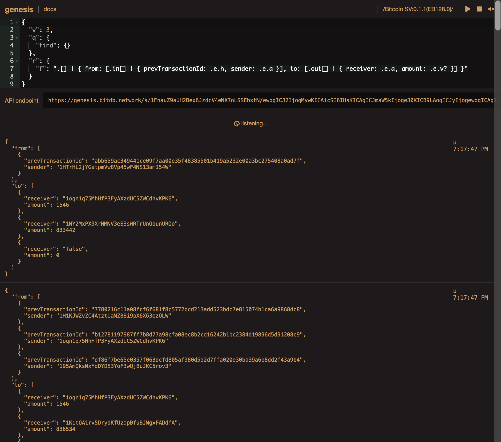
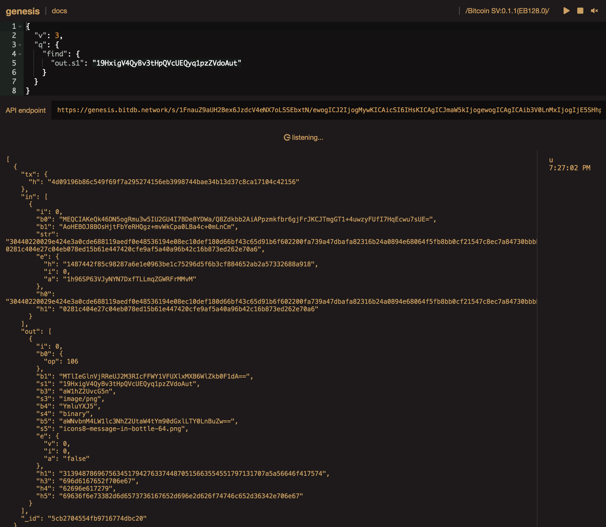
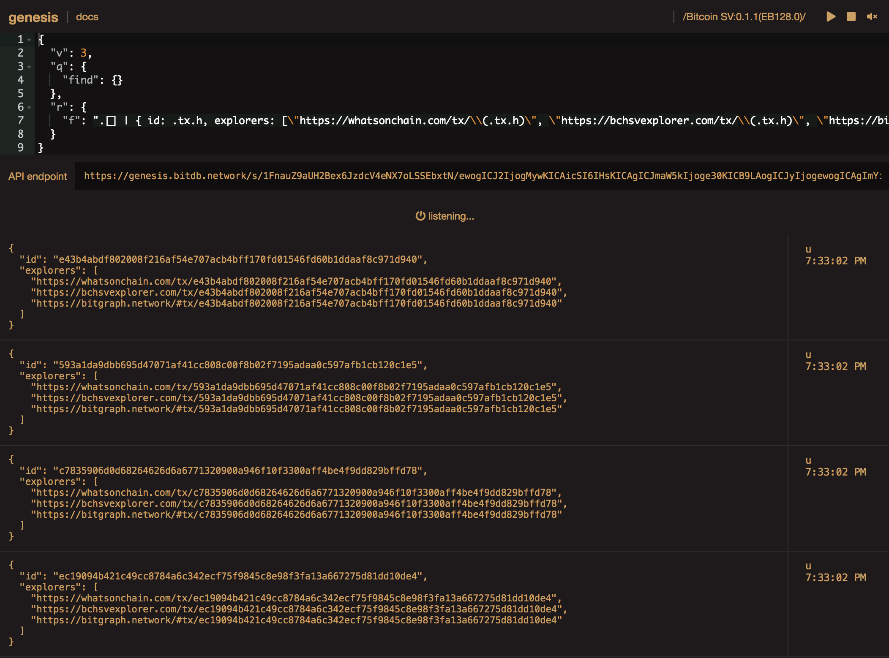

# Bitsocket

Along with the query endpoint (via Bitquery), Planaria ships with built-in Bitsocket endpoint.

Bitsocket is a powerful bitcoin push notification service for building realtime bitcoin applications.

Bitsocket lets you subscribe to any pattern of realtime bitcoin transactions through Bitquery and build apps that are driven by the event.



It is 100% open source and designed to be decentralized.

## Usage

Using bitsocket as a bitcoin message bus, it is possible to construct various bitcoin application architectures through message piping:

#### 1. Bitcoin => App

Build applications that listen to and run on various Bitcoin events

#### 2. Bitcoin => App => 3rd party API

Build applications that listen to Bitcoin events and trigger 3rd party APIs

#### 3. Bitcoin => App => Bitcoin

Build apps that listen to certain patterns of transactions, and then trigger another bitcoin transaction in response. Create a looping program on Bitcoin.

####  4. App1 =>  Bitcoin => App2

Create apps that communicate with one another through Bitcoin transactions. To communicate, App1 can send an immutable message to App2 by making a bitcoin transaction, to which App2 is listening and triggers its own custom action in response. Like Inter-process calls (IPC), but for Bitcoin.

## How does it work?

### 1. TRANSFORM

Bitsocket transforms every incoming raw bitcoin transaction into a structured format that can be filtered, transformed, and programmed, in realtime.



### 2. EVENTIFY

All the clients plugged into bitsocket subscribe with their own application-specific filter powered by Bitquery, a Turing complete bitcoin query language. Bitsocket takes the transformed transaction object from the previous step and programmatically turns it into application-specific events in realtime.



### 3. PUSH

Each transformed event from the previous step is pushed to the corresponding application via SSE (Server Sent Events). The apps can be anything from a mobile app to web app to server side app to a hardware device.




## Why is it powerful?

### 1. REALTIME

Bitsocket lets you monitor realtime Bitcoin network like never before:

1. Write a query to filter EXACTLY the events you want
2. From the ENTIRE bitcoin universe (not just a single wallet address or a transaction id. Everything.)

And it's as easy as using websockets (Actually it's SSE). Here's an example of an actual functional code:

```
// Write a bitquery
var query = {
  "v": 3, "q": { "find": {} }
}

// Encode it in base64 format
var b64 = btoa(JSON.stringify(query))

// Subscribe
var bitsocket = new EventSource('https://genesis.bitdb.network/s/1FnauZ9aUH2Bex6JzdcV4eNX7oLSSEbxtN/'+b64)

// Event handler
bitsocket.onmessage = function(e) {
  console.log(e.data)
}
```

### 2. PORTABLE

Notice from above code that, the `EventSource` is opening a connection to a base64-encoded JSON query object

```
{
  "v": 3,
  "q": { "find": { "out.h1": "6d02" } }
}
```

Basically, you're subscribing to that unique base64 encoded string instead of a specific URL.

This content-addressed subscription scheme means multiple bitsocket nodes will always produce the same push notification sets for the same query.

If a bitsocket node goes down, all apps plugged into that node can seamlessly migrate to another bitsocket node, providing application portability and decentralization.

### 3. PROGRAMMABLE

The query language is not just for simple filtering.

It's powered by Bitquery, a Turing complete Bitcoin query language, which means you can build a programming logic into the query itself to build a custom push API.

For example, you can build your own custom push API for ONLY listening to a certain pattern (memo.cash posts) and then process the raw event to only return the part you need, by adding an additional "processing" step to the query (`r.f`). Here's an example:

```
{
  "v": 3,
  "q": {
    "find": { "out.h1": "6d02" }
  },
  "r": {
    "f": ".[] | .out[] | select(.b0.op? == 106) | .s2"
  }
}
```

> **You can learn more about the programmability here: [Learn Bitquery](/query)**

You can also use bitsocket to programmatically trigger ANYTHING.

1. send mobile push notifications
2. trigger an event for a 3rd party application
3. trigger certain action for a hardware device
4. trigger another bitcoin transaction
5. send event to another bitcoin app through bitcoin transaction

All you need to do is write an event handler:

```
bitsocket.on("message", function(event) {
  // Use the 'event' to run whatever logic you want here!
})
```

What's possible is only bound by your imagination.


### 4. BITQUERY

Bitsocket uses the same query language for querying the Planaria database ([Bitquery](/query))

You can think of the query endpoint as a "pull" service, and the socket endpoint as a "push" service.

You can use both in a single application to complement each other.


## Examples

### 1. Listen to Realtime Transaction Graph

You can listen to a transformed version of each transaction event, through [Bitquery's Response Handler function](/query?id=r)

```
{
  "v": 3,
  "q": {
    "find": {}
  },
  "r": {
    "f": ".[] | { from: [.in[] | { prevTransactionId: .e.h, sender: .e.a }], to: [.out[] | { receiver: .e.a, amount: .e.v? }] }"
  }
}
```




Try here: [https://genesis.bitdb.network/socket/1FnauZ9aUH2Bex6JzdcV4eNX7oLSSEbxtN/ewogICJ2IjogMywKICAicSI6IHsKICAgICJmaW5kIjoge30KICB9LAogICJyIjogewogICAgImYiOiAiLltdIHwgeyBmcm9tOiBbLmluW10gfCB7IHByZXZUcmFuc2FjdGlvbklkOiAuZS5oLCBzZW5kZXI6IC5lLmEgfV0sIHRvOiBbLm91dFtdIHwgeyByZWNlaXZlcjogLmUuYSwgYW1vdW50OiAuZS52PyB9XSB9IgogIH0KfQ==](https://genesis.bitdb.network/socket/1FnauZ9aUH2Bex6JzdcV4eNX7oLSSEbxtN/ewogICJ2IjogMywKICAicSI6IHsKICAgICJmaW5kIjoge30KICB9LAogICJyIjogewogICAgImYiOiAiLltdIHwgeyBmcm9tOiBbLmluW10gfCB7IHByZXZUcmFuc2FjdGlvbklkOiAuZS5oLCBzZW5kZXI6IC5lLmEgfV0sIHRvOiBbLm91dFtdIHwgeyByZWNlaXZlcjogLmUuYSwgYW1vdW50OiAuZS52PyB9XSB9IgogIH0KfQ==)


### 2. Memo Protocol Posts

[Memo](https://memo.sv) is a Social networking service built on top of Bitcoin OP_RETURN transactions.

Transactions are uploaded following a [Protocol](https://memo.sv/protocol) and parsed according to the protocol to display as a website.

We can listen to realtime Memo posts using Bitsocket:

[https://genesis.bitdb.network/socket/1FnauZ9aUH2Bex6JzdcV4eNX7oLSSEbxtN/ewogICJ2IjogMywKICAicSI6IHsKICAgICJmaW5kIjogewogICAgICAib3V0LmgxIjogIjZkMDIiCiAgICB9CiAgfSwKICAiciI6IHsKICAgICJmIjogIi5bXSB8IC5vdXRbXSB8IHNlbGVjdCguYjAub3A/ID09IDEwNikgfCAuczIiCiAgfQp9](https://genesis.bitdb.network/socket/1FnauZ9aUH2Bex6JzdcV4eNX7oLSSEbxtN/ewogICJ2IjogMywKICAicSI6IHsKICAgICJmaW5kIjogewogICAgICAib3V0LmgxIjogIjZkMDIiCiAgICB9CiAgfSwKICAiciI6IHsKICAgICJmIjogIi5bXSB8IC5vdXRbXSB8IHNlbGVjdCguYjAub3A/ID09IDEwNikgfCAuczIiCiAgfQp9)

```
{
  "v": 3,
  "q": {
    "find": {
      "out.h1": "6d02"
    }
  },
  "r": {
    "f": ".[] | .out[] | select(.b0.op? == 106) | .s2"
  }
}
```

### 3. Memo.cash Topic Posts

[https://genesis.bitdb.network/socket/1FnauZ9aUH2Bex6JzdcV4eNX7oLSSEbxtN/ewogICJ2IjogMywKICAicSI6IHsKICAgICJmaW5kIjogewogICAgICAib3V0LmgxIjogIjZkMGMiLAogICAgICAib3V0LnMyIjogInBsYXlCQ0hfYm90IgogICAgfQogIH0sCiAgInIiOiB7CiAgICAiZiI6ICIuW10gfCAub3V0W10gfCBzZWxlY3QoLmIwLm9wPyA9PSAxMDYpIHwgLnMzIgogIH0KfQ==](https://genesis.bitdb.network/socket/1FnauZ9aUH2Bex6JzdcV4eNX7oLSSEbxtN/ewogICJ2IjogMywKICAicSI6IHsKICAgICJmaW5kIjogewogICAgICAib3V0LmgxIjogIjZkMGMiLAogICAgICAib3V0LnMyIjogInBsYXlCQ0hfYm90IgogICAgfQogIH0sCiAgInIiOiB7CiAgICAiZiI6ICIuW10gfCAub3V0W10gfCBzZWxlY3QoLmIwLm9wPyA9PSAxMDYpIHwgLnMzIgogIH0KfQ==)

```
{
  "v": 3,
  "q": {
    "find": {
      "out.h1": "6d0c",
      "out.s2": "playBCH_bot"
    }
  },
  "r": {
    "f": ".[] | .out[] | select(.b0.op? == 106) | .s3"
  }
}
```

### 4. B:// Protocol Posts

[B://](https://b.bitdb.network) is a File Upload protocol built on top of Bitcoin OP_RETURN transactions. We can listen to all realtime B:// uploads by listening to the B:// protocol prefix:

```
{
  "v": 3,
  "q": {
    "find": {
      "out.s1": "19HxigV4QyBv3tHpQVcUEQyq1pzZVdoAut"
    }
  }
}
```



Try Here: [https://genesis.bitdb.network/socket/1FnauZ9aUH2Bex6JzdcV4eNX7oLSSEbxtN/ewogICJ2IjogMywKICAicSI6IHsKICAgICJmaW5kIjogewogICAgICAib3V0LnMxIjogIjE5SHhpZ1Y0UXlCdjN0SHBRVmNVRVF5cTFwelpWZG9BdXQiCiAgICB9CiAgfQp9](https://genesis.bitdb.network/socket/1FnauZ9aUH2Bex6JzdcV4eNX7oLSSEbxtN/ewogICJ2IjogMywKICAicSI6IHsKICAgICJmaW5kIjogewogICAgICAib3V0LnMxIjogIjE5SHhpZ1Y0UXlCdjN0SHBRVmNVRVF5cTFwelpWZG9BdXQiCiAgICB9CiAgfQp9)


### 5. Transformed Response

Thanks to Bitquery's programmability, you can do string interpolations easily using a JQ syntax:

```
{
  "v": 3,
  "q": {
    "find": {}
  },
  "r": {
    "f": ".[] | { id: .tx.h, explorers: [\"https://whatsonchain.com/tx/\\(.tx.h)\", \"https://bchsvexplorer.com/tx/\\(.tx.h)\", \"https://bitgraph.network/#tx/\\(.tx.h)\"] }"
  }
}
```

> Learn more about [Bitquery](/query)



Try here: [https://genesis.bitdb.network/socket/1FnauZ9aUH2Bex6JzdcV4eNX7oLSSEbxtN/ewogICJ2IjogMywKICAicSI6IHsKICAgICJmaW5kIjoge30KICB9LAogICJyIjogewogICAgImYiOiAiLltdIHwgeyBpZDogLnR4LmgsIGV4cGxvcmVyczogW1wiaHR0cHM6Ly93aGF0c29uY2hhaW4uY29tL3R4L1xcKC50eC5oKVwiLCBcImh0dHBzOi8vYmNoc3ZleHBsb3Jlci5jb20vdHgvXFwoLnR4LmgpXCIsIFwiaHR0cHM6Ly9iaXRncmFwaC5uZXR3b3JrLyN0eC9cXCgudHguaClcIl0gfSIKICB9Cn0=](https://genesis.bitdb.network/socket/1FnauZ9aUH2Bex6JzdcV4eNX7oLSSEbxtN/ewogICJ2IjogMywKICAicSI6IHsKICAgICJmaW5kIjoge30KICB9LAogICJyIjogewogICAgImYiOiAiLltdIHwgeyBpZDogLnR4LmgsIGV4cGxvcmVyczogW1wiaHR0cHM6Ly93aGF0c29uY2hhaW4uY29tL3R4L1xcKC50eC5oKVwiLCBcImh0dHBzOi8vYmNoc3ZleHBsb3Jlci5jb20vdHgvXFwoLnR4LmgpXCIsIFwiaHR0cHM6Ly9iaXRncmFwaC5uZXR3b3JrLyN0eC9cXCgudHguaClcIl0gfSIKICB9Cn0=)


## One Bitsocket per Machine

Remember, every Planaria node implements its own custom Bitsocket endpoint, which means depending on the Planaria you use, you can get wide variety of notifications.

In this document we only looked at the [Genesis](https://genesis.bitdb.network) node, but you can find a whole category of other nodes at [Planaria Network](https://planaria.network)

The best way to find out what these nodes send as push notifications is to just open the socket explorer for each endpoint and try


```
{
  "v": 3,
  "q": {
    "find": {}
  }
}
```

And that will start listening to every event that happens on that machine. From there you can start filtering down to the specific pattern you wish to listen to.
